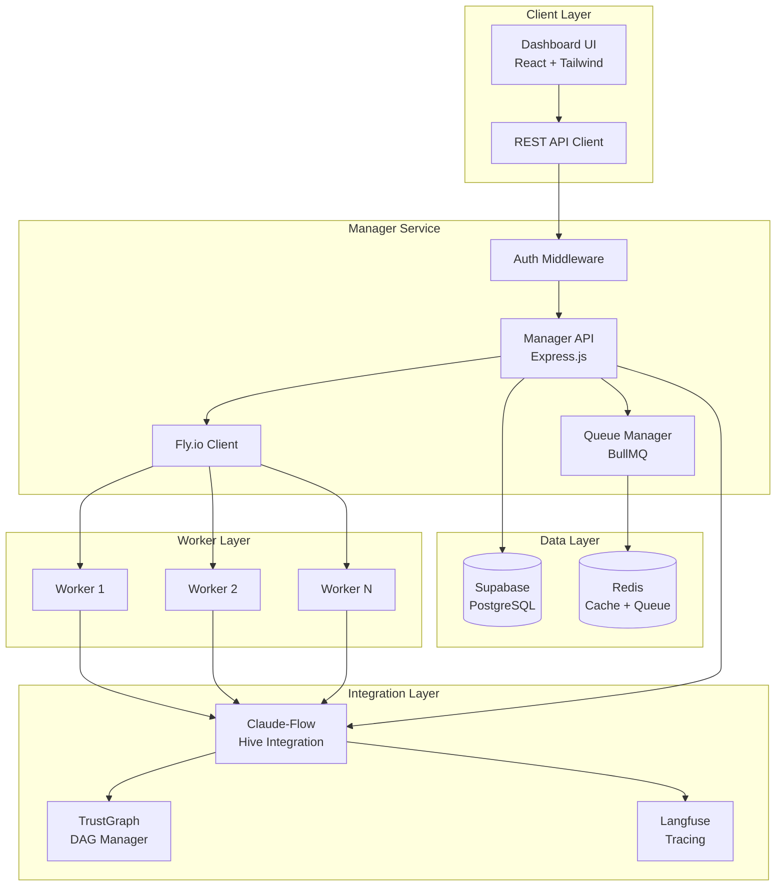

# Hive Mind Swarm Orchestrator Architecture

## System Overview

The Hive Mind Swarm Orchestrator is a distributed system designed to manage and orchestrate worker swarms on Fly.io infrastructure. The system leverages AI-driven coordination through Claude-Flow integration, task dependency management via TrustGraph DAG, and comprehensive observability through Langfuse tracing.

## Architecture Components

### 1. Frontend Dashboard (React + Tailwind)
- **Technology**: Next.js 14, React 18, Tailwind CSS
- **State Management**: React Query for server state
- **Authentication**: Supabase Auth integration
- **Real-time Updates**: Supabase Realtime subscriptions

### 2. Manager Service API
- **Technology**: Express.js with TypeScript
- **Queue Management**: BullMQ with Redis
- **Database**: Supabase (PostgreSQL)
- **Deployment**: Fly.io Machines API
- **Monitoring**: Winston logging + Prometheus metrics

### 3. Worker Swarm
- **Technology**: Node.js workers with TypeScript
- **Communication**: Redis pub/sub + BullMQ
- **Orchestration**: Autonomous task execution
- **Scaling**: Dynamic scaling based on workload

### 4. Integration Services
- **Claude-Flow**: AI-powered coordination and decision making
- **TrustGraph**: DAG-based task dependency management
- **Langfuse**: LLM operation tracing and analytics

## System Architecture Diagram



## API Architecture

### Manager Service REST Endpoints

#### Swarm Management
```typescript
POST   /api/swarms              // Create new swarm
GET    /api/swarms              // List all swarms
GET    /api/swarms/:id          // Get swarm details
PUT    /api/swarms/:id          // Update swarm configuration
DELETE /api/swarms/:id          // Destroy swarm
PUT    /api/swarms/:id/scale    // Scale worker count
POST   /api/swarms/:id/start    // Start swarm
POST   /api/swarms/:id/stop     // Stop swarm
```

#### Worker Management
```typescript
GET    /api/swarms/:id/workers              // List workers
GET    /api/swarms/:id/workers/:workerId    // Get worker details
POST   /api/swarms/:id/workers              // Spawn new worker
DELETE /api/swarms/:id/workers/:workerId    // Remove worker
GET    /api/swarms/:id/workers/:workerId/logs // Get worker logs
```

#### Task Management
```typescript
POST   /api/swarms/:id/tasks                // Submit task
GET    /api/swarms/:id/tasks                // List tasks
GET    /api/swarms/:id/tasks/:taskId        // Get task details
PUT    /api/swarms/:id/tasks/:taskId        // Update task
DELETE /api/swarms/:id/tasks/:taskId        // Cancel task
GET    /api/swarms/:id/tasks/:taskId/status // Get task status
```

#### Monitoring & Metrics
```typescript
GET    /api/swarms/:id/metrics              // Get swarm metrics
GET    /api/swarms/:id/logs                 // Get swarm logs
GET    /api/swarms/:id/events               // Get event stream (SSE)
GET    /api/swarms/:id/health               // Health check
GET    /api/swarms/:id/performance          // Performance metrics
```

#### Templates & Configuration
```typescript
GET    /api/templates                       // List templates
POST   /api/templates                       // Create template
GET    /api/templates/:id                   // Get template
PUT    /api/templates/:id                   // Update template
DELETE /api/templates/:id                   // Delete template
```

## Database Schema

### Core Tables

#### swarms
```sql
CREATE TABLE swarms (
    id UUID PRIMARY KEY,
    name VARCHAR(255) NOT NULL,
    purpose TEXT,
    status VARCHAR(50) NOT NULL, -- initializing, running, stopped, error
    worker_count INTEGER DEFAULT 0,
    config JSONB NOT NULL DEFAULT '{}',
    metrics JSONB NOT NULL DEFAULT '{}',
    fly_app_name VARCHAR(255) UNIQUE,
    error TEXT,
    created_at TIMESTAMPTZ DEFAULT NOW(),
    updated_at TIMESTAMPTZ DEFAULT NOW(),
    created_by UUID,
    organization_id UUID
);
```

#### workers
```sql
CREATE TABLE workers (
    id UUID PRIMARY KEY,
    swarm_id UUID NOT NULL REFERENCES swarms(id),
    name VARCHAR(255) NOT NULL,
    type VARCHAR(50) NOT NULL, -- general, specialized, coordinator
    status VARCHAR(50) NOT NULL, -- idle, busy, error, terminated
    machine_id VARCHAR(255),
    last_heartbeat TIMESTAMPTZ,
    config JSONB NOT NULL DEFAULT '{}',
    metrics JSONB NOT NULL DEFAULT '{}',
    created_at TIMESTAMPTZ DEFAULT NOW(),
    updated_at TIMESTAMPTZ DEFAULT NOW()
);
```

#### tasks
```sql
CREATE TABLE tasks (
    id UUID PRIMARY KEY,
    swarm_id UUID NOT NULL REFERENCES swarms(id),
    worker_id UUID REFERENCES workers(id),
    type VARCHAR(100) NOT NULL,
    status VARCHAR(50) NOT NULL, -- pending, queued, active, completed, failed
    priority INTEGER DEFAULT 0,
    input JSONB,
    output JSONB,
    error TEXT,
    retry_count INTEGER DEFAULT 0,
    max_retries INTEGER DEFAULT 3,
    dependencies JSONB, -- TrustGraph DAG dependencies
    started_at TIMESTAMPTZ,
    completed_at TIMESTAMPTZ,
    created_at TIMESTAMPTZ DEFAULT NOW(),
    updated_at TIMESTAMPTZ DEFAULT NOW()
);
```

#### hive_messages
```sql
CREATE TABLE hive_messages (
    id UUID PRIMARY KEY,
    swarm_id UUID REFERENCES swarms(id),
    from_worker_id UUID REFERENCES workers(id),
    to_worker_ids UUID[],
    type VARCHAR(50) NOT NULL, -- command, query, response, event
    action VARCHAR(100) NOT NULL,
    payload JSONB,
    correlation_id UUID,
    created_at TIMESTAMPTZ DEFAULT NOW()
);
```

#### claude_flow_decisions
```sql
CREATE TABLE claude_flow_decisions (
    id UUID PRIMARY KEY,
    swarm_id UUID REFERENCES swarms(id),
    decision_type VARCHAR(100) NOT NULL,
    context JSONB NOT NULL,
    decision JSONB NOT NULL,
    confidence FLOAT,
    reasoning TEXT,
    created_at TIMESTAMPTZ DEFAULT NOW()
);
```

#### trust_graph_nodes
```sql
CREATE TABLE trust_graph_nodes (
    id UUID PRIMARY KEY,
    swarm_id UUID REFERENCES swarms(id),
    task_id UUID REFERENCES tasks(id),
    node_type VARCHAR(50) NOT NULL, -- task, decision, checkpoint
    dependencies UUID[],
    status VARCHAR(50) NOT NULL, -- pending, active, completed
    data JSONB,
    created_at TIMESTAMPTZ DEFAULT NOW(),
    updated_at TIMESTAMPTZ DEFAULT NOW()
);
```

#### langfuse_traces
```sql
CREATE TABLE langfuse_traces (
    id UUID PRIMARY KEY,
    trace_id VARCHAR(255) UNIQUE NOT NULL,
    swarm_id UUID REFERENCES swarms(id),
    session_id VARCHAR(255),
    user_id UUID,
    metadata JSONB,
    created_at TIMESTAMPTZ DEFAULT NOW()
);
```

## Authentication & Authorization

### Authentication Flow
1. **User Registration/Login**: Via Supabase Auth
2. **JWT Token**: Issued by Supabase, validated by Manager API
3. **Session Management**: Handled by Supabase with refresh tokens
4. **API Authentication**: Bearer token in Authorization header

### Authorization Model
```typescript
interface User {
    id: string
    email: string
    role: 'admin' | 'developer' | 'viewer'
    organizationId: string
}

interface Organization {
    id: string
    name: string
    plan: 'free' | 'pro' | 'enterprise'
    limits: {
        maxSwarms: number
        maxWorkersPerSwarm: number
        maxMonthlyTasks: number
    }
}
```

## Integration Architecture

### Claude-Flow Hive Integration
```typescript
interface ClaudeFlowHiveConfig {
    swarmId: string
    queenType: 'strategic' | 'tactical' | 'operational'
    consensusAlgorithm: 'majority' | 'unanimous' | 'weighted'
    workerDistribution: {
        researchers: number
        coders: number
        analysts: number
        testers: number
        coordinators: number
    }
    objective: string
    memoryPersistence: boolean
}

// Integration hooks
interface HiveHooks {
    onTaskAssignment: (task: Task, worker: Worker) => Promise<void>
    onDecisionPoint: (context: any) => Promise<Decision>
    onConsensusRequired: (proposals: Proposal[]) => Promise<Consensus>
    onWorkerCoordination: (message: HiveMessage) => Promise<void>
}
```

### TrustGraph DAG Integration
```typescript
interface TrustGraphDAG {
    id: string
    swarmId: string
    nodes: Map<string, TrustGraphNode>
    edges: Map<string, string[]> // node -> dependencies
    
    addNode(node: TrustGraphNode): void
    addDependency(nodeId: string, dependencyId: string): void
    getExecutionOrder(): string[]
    markCompleted(nodeId: string): void
    getNextExecutable(): TrustGraphNode[]
}
```

### Langfuse Tracing Integration
```typescript
interface LangfuseIntegration {
    traceSwarmOperation(operation: {
        swarmId: string
        operationType: string
        input: any
        output?: any
        duration?: number
        metadata?: Record<string, any>
    }): Promise<void>
    
    traceWorkerTask(task: {
        workerId: string
        taskId: string
        llmCalls: LLMCall[]
        result: any
        tokens: number
    }): Promise<void>
}
```

## Deployment Architecture

### Infrastructure Components
```yaml
# Manager Service (Fly.io)
app: swarm-manager
regions: ["iad", "lax", "lhr"]
services:
  - internal_port: 3001
    protocol: tcp
    ports:
      - port: 443
        handlers: ["tls", "http"]
      - port: 80
        handlers: ["http"]

# Worker Template (Fly.io Machines)
machine_config:
  image: "registry.fly.io/swarm-worker:latest"
  size: "shared-cpu-1x"
  services:
    - internal_port: 3000
      protocol: tcp
  env:
    REDIS_URL: "{{REDIS_URL}}"
    SWARM_ID: "{{SWARM_ID}}"
    WORKER_TYPE: "{{WORKER_TYPE}}"
```

### Scaling Strategy
1. **Horizontal Scaling**: Add/remove workers based on queue depth
2. **Vertical Scaling**: Upgrade machine types for resource-intensive tasks
3. **Geographic Distribution**: Deploy workers across regions for latency optimization
4. **Auto-scaling Rules**:
   - Scale up when queue depth > 100 tasks
   - Scale down when workers idle > 5 minutes
   - Maintain minimum 2 workers per swarm

## Security Architecture

### Security Layers
1. **API Security**
   - HTTPS/TLS encryption
   - Rate limiting per user/IP
   - CORS configuration
   - Helmet.js security headers

2. **Authentication & Authorization**
   - Supabase Auth with MFA support
   - Row Level Security (RLS) in PostgreSQL
   - API key management for programmatic access

3. **Data Security**
   - Encryption at rest (Supabase)
   - Encryption in transit (TLS)
   - Sensitive data masking in logs

4. **Infrastructure Security**
   - Fly.io private networking
   - Environment variable management
   - Secrets rotation policy

## Monitoring & Observability

### Metrics Collection
```typescript
interface SwarmMetrics {
    // System Metrics
    cpu_usage: number
    memory_usage: number
    disk_usage: number
    network_io: {
        bytes_in: number
        bytes_out: number
    }
    
    // Application Metrics
    active_workers: number
    queue_depth: number
    tasks_per_minute: number
    average_task_duration: number
    success_rate: number
    error_rate: number
    
    // Business Metrics
    tokens_consumed: number
    api_calls_made: number
    cost_per_task: number
}
```

### Logging Strategy
1. **Structured Logging**: JSON format with correlation IDs
2. **Log Levels**: ERROR, WARN, INFO, DEBUG
3. **Log Aggregation**: Centralized in Supabase logs table
4. **Log Retention**: 30 days standard, 90 days for errors

### Alerting Rules
- Swarm error rate > 10%
- Worker heartbeat missed > 30 seconds
- Queue depth > 1000 tasks
- API response time > 2 seconds
- Database connection pool exhausted

## Performance Optimization

### Caching Strategy
1. **Redis Caching**
   - Swarm configurations (TTL: 5 minutes)
   - Worker status (TTL: 30 seconds)
   - Task results (TTL: 1 hour)

2. **Database Query Optimization**
   - Indexed columns for frequent queries
   - Materialized views for analytics
   - Connection pooling

3. **API Response Optimization**
   - Pagination for list endpoints
   - Field filtering
   - Response compression

### Load Balancing
- Fly.io automatic load balancing
- Regional routing for lowest latency
- Health check endpoints for availability

## Error Handling & Recovery

### Error Categories
1. **Transient Errors**: Automatic retry with exponential backoff
2. **System Errors**: Circuit breaker pattern
3. **User Errors**: Detailed error messages with remediation steps

### Recovery Strategies
1. **Task Failure**: Retry up to 3 times, then move to dead letter queue
2. **Worker Failure**: Reassign tasks to healthy workers
3. **Swarm Failure**: Attempt restart, notify administrators
4. **Database Failure**: Failover to read replica, queue writes

## Development & Deployment

### Development Workflow
1. **Local Development**: Docker Compose setup
2. **Testing**: Unit, integration, and E2E tests
3. **CI/CD**: GitHub Actions for automated testing and deployment
4. **Environment Management**: Dev, Staging, Production

### Deployment Process
```bash
# Deploy Manager Service
fly deploy --app swarm-manager

# Deploy Worker Image
docker build -t registry.fly.io/swarm-worker:latest .
docker push registry.fly.io/swarm-worker:latest

# Database Migrations
supabase migration up
```

## Future Enhancements

1. **Multi-Cloud Support**: AWS, GCP, Azure integration
2. **Advanced Analytics**: ML-based performance optimization
3. **Plugin System**: Custom worker types and integrations
4. **GraphQL API**: Alternative to REST for complex queries
5. **WebSocket Support**: Real-time bidirectional communication
6. **Kubernetes Support**: Alternative orchestration platform