# Hive Mind Swarm Orchestrator - Architecture Diagrams

## System Overview Diagram

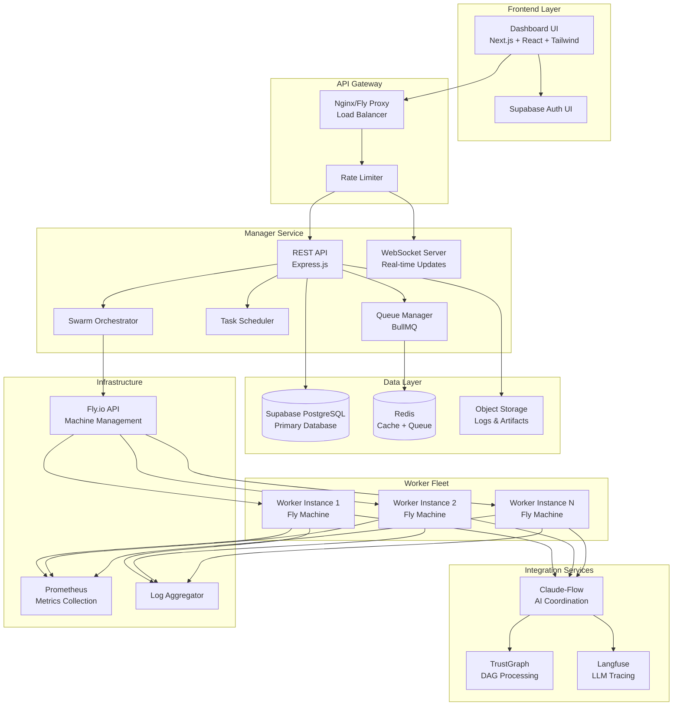

## Request Flow Diagram

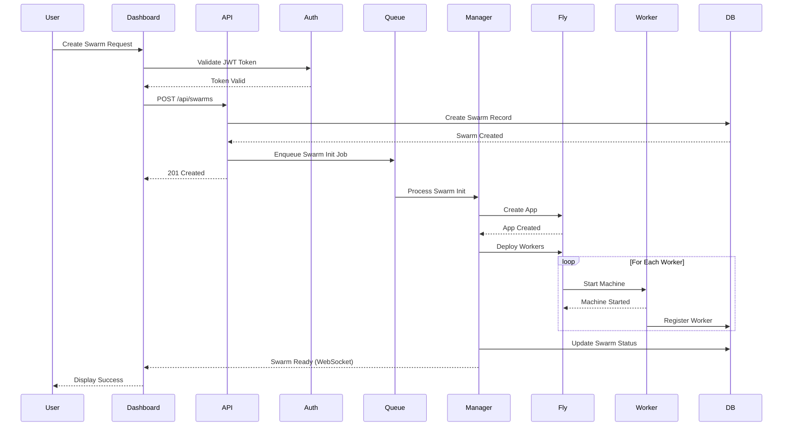

## Worker Communication Flow

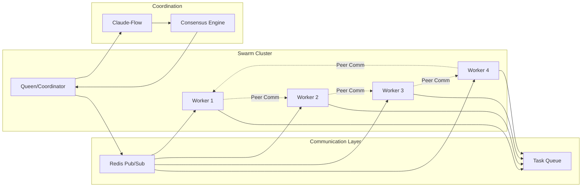

## Database Schema Relationships

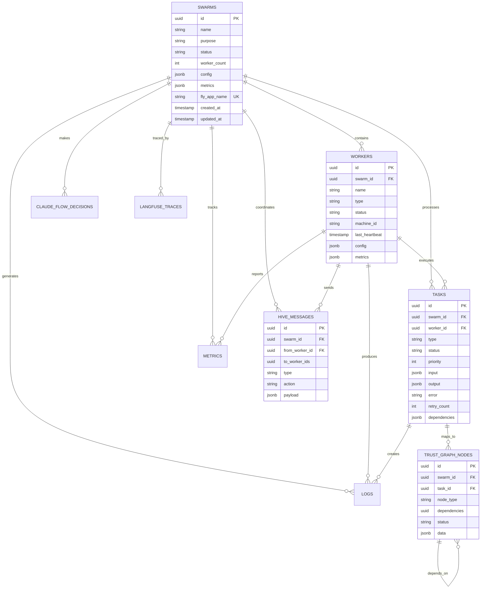

## Task Processing Pipeline

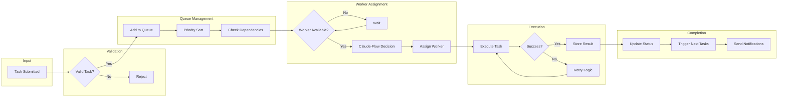

## Scaling Architecture

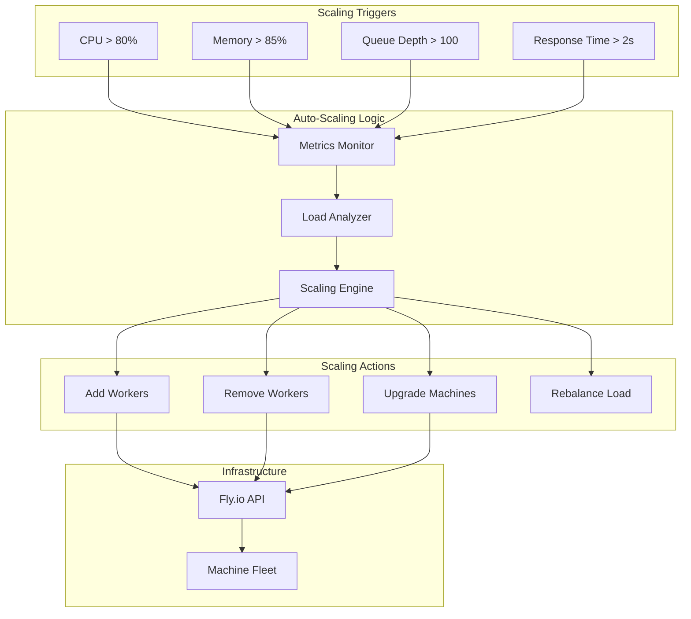

## Security Architecture

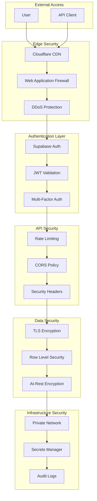

## Claude-Flow Integration Architecture

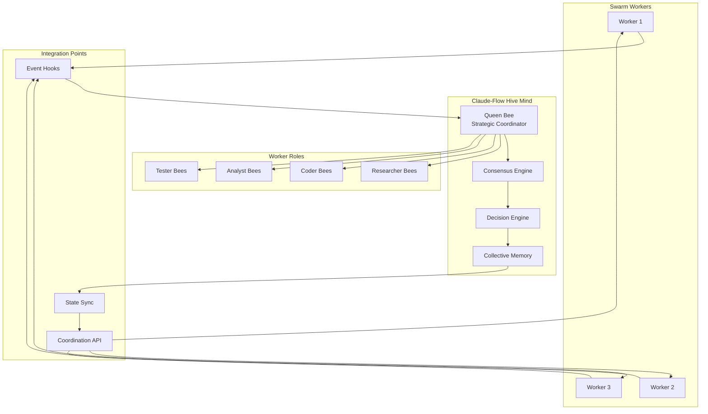

## Deployment Architecture

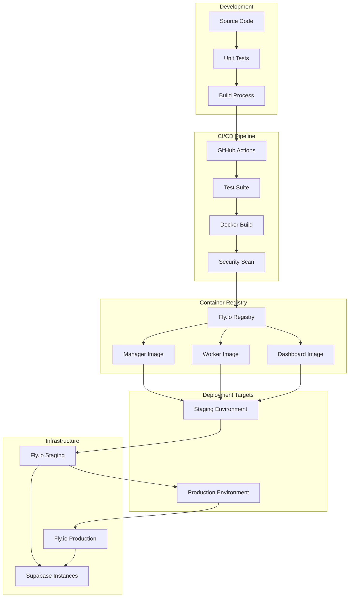

## Monitoring & Observability Stack

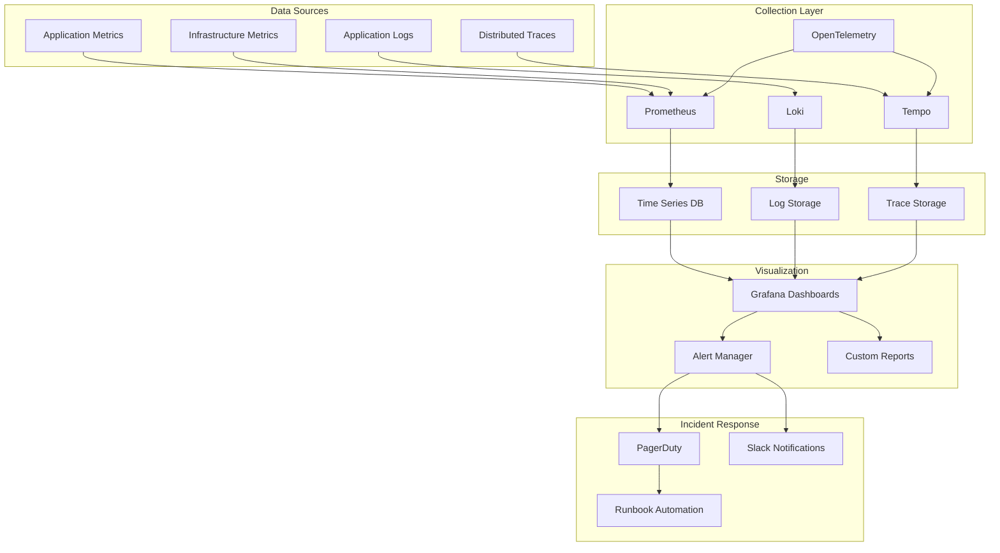

## Error Handling Flow

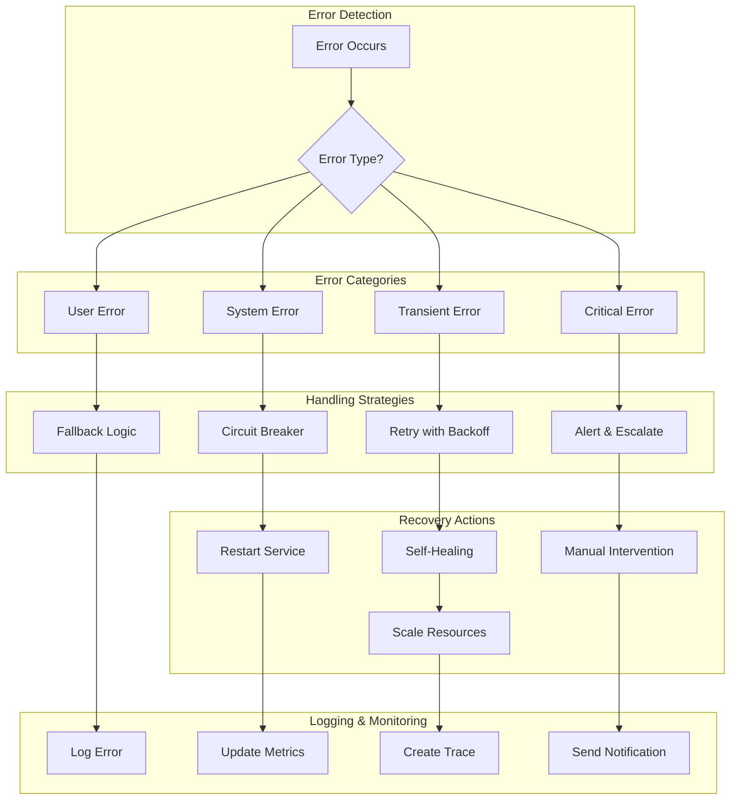