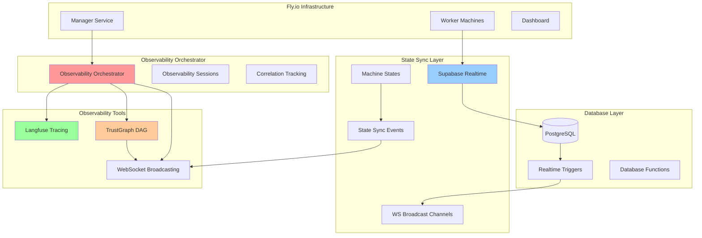
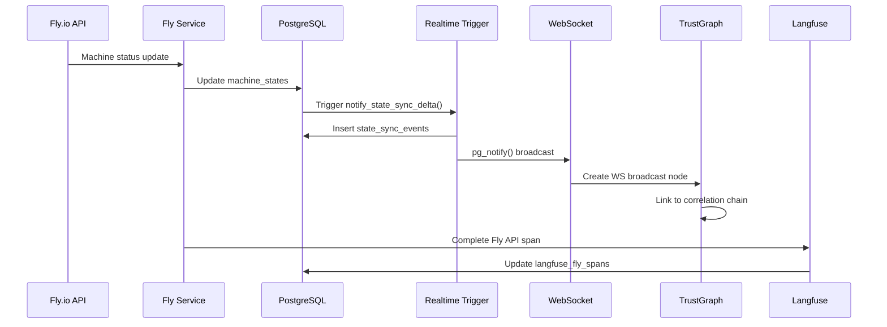
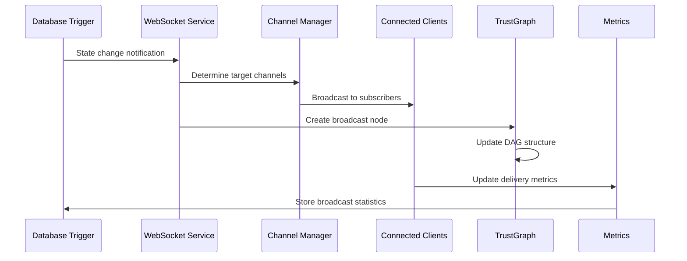

# State Sync & Observability Architecture

## Executive Summary

This document describes the comprehensive state synchronization and observability architecture implemented for the Hive Mind Swarm Orchestrator. The system provides real-time machine state persistence, WebSocket delta forwarding, TrustGraph node emission for 'ws.broadcast' events, and Langfuse span wrapping for Fly API calls with full correlation tracking.

## Architecture Overview



## Core Components

### 1. Machine State Persistence (`machine_states` table)

**Purpose**: Persistent storage of Fly.io machine state with observability integration

**Key Features**:
- **Comprehensive State Tracking**: Status, region, resources, health metrics
- **Observability Integration**: Links to Langfuse traces and TrustGraph nodes
- **Real-time Updates**: Automatic triggers for state changes
- **Network Information**: Private/public IPs, internal ports
- **Lifecycle Management**: Provisioned, started, stopped, destroyed timestamps

**Schema**:
```sql
CREATE TABLE machine_states (
    id UUID PRIMARY KEY,
    swarm_id UUID NOT NULL REFERENCES swarms(id),
    machine_id VARCHAR(255) NOT NULL UNIQUE,
    status VARCHAR(50) NOT NULL DEFAULT 'initializing',
    region VARCHAR(10) NOT NULL,
    fly_app_name VARCHAR(255) NOT NULL,
    config JSONB NOT NULL DEFAULT '{}',
    metrics JSONB NOT NULL DEFAULT '{}',
    private_ip INET,
    public_ip INET,
    cpu_count INTEGER DEFAULT 1,
    memory_mb INTEGER DEFAULT 256,
    langfuse_trace_id VARCHAR(255),
    trustgraph_node_id UUID,
    last_heartbeat TIMESTAMPTZ,
    health_status VARCHAR(20) DEFAULT 'unknown',
    -- ... additional fields
);
```

### 2. Supabase Realtime Delta Forwarding

**Purpose**: Real-time WebSocket broadcasting of machine state changes

**Key Features**:
- **Automatic Trigger System**: PostgreSQL triggers detect state changes
- **Delta Computation**: Only changed fields are broadcast
- **Multi-Channel Broadcasting**: Swarm-specific and global channels
- **Correlation Tracking**: Full event correlation across systems

**Trigger Implementation**:
```sql
CREATE OR REPLACE FUNCTION notify_state_sync_delta()
RETURNS TRIGGER AS $$
DECLARE
    delta_payload JSONB;
    channel_name TEXT;
BEGIN
    -- Compute delta between old and new states
    delta_payload := jsonb_build_object(
        'event_type', 'state_change',
        'machine_id', NEW.machine_id,
        'swarm_id', NEW.swarm_id,
        'changes', jsonb_build_object(
            'status', CASE WHEN OLD.status != NEW.status THEN 
                jsonb_build_object('from', OLD.status, 'to', NEW.status) 
            END
            -- ... other field changes
        ),
        'timestamp', NOW()
    );
    
    -- Send WebSocket notification
    channel_name := 'swarm:' || NEW.swarm_id || ':machine_states';
    PERFORM pg_notify(channel_name, delta_payload::text);
    
    RETURN NEW;
END;
$$ LANGUAGE plpgsql;
```

### 3. TrustGraph WebSocket Node Emission

**Purpose**: Create DAG nodes for all WebSocket broadcast events with relationship tracking

**Key Features**:
- **Event Node Creation**: Every WS broadcast becomes a TrustGraph node
- **Relationship Mapping**: Edges connect triggering events to broadcasts
- **Correlation Chains**: Full traceability across operations
- **Visualization Support**: Real-time DAG visualization data

**Implementation**:
```typescript
async emitTrustGraphWSNode(
    swarmId: string,
    eventType: string,
    channel: string,
    payload: any,
    correlationId?: string
): Promise<WSBroadcastNode> {
    const wsNode = await this.createWSBroadcastNode({
        type: 'ws_broadcast',
        label: `WS Broadcast: ${eventType}`,
        ws_event_type: eventType,
        ws_channel: channel,
        ws_payload: payload,
        correlation_id: correlationId
    });

    // Create edges from triggering events
    if (correlationId) {
        const triggeringNodes = this.findNodesByCorrelation(correlationId);
        for (const triggerNode of triggeringNodes) {
            await this.createEdge({
                source: triggerNode.id,
                target: wsNode.id,
                label: 'triggers_broadcast',
                type: 'triggers'
            });
        }
    }

    return wsNode;
}
```

### 4. Langfuse Fly API Span Wrapping

**Purpose**: Comprehensive tracing of all Fly.io API operations with token and latency tracking

**Key Features**:
- **Automatic Span Creation**: Every Fly API call gets a Langfuse span
- **Performance Metrics**: Token consumption, latency, cost tracking
- **Error Handling**: Full error capture and correlation
- **Database Persistence**: Spans stored in `langfuse_fly_spans` table

**Wrapper Implementation**:
```typescript
private async wrapWithObservability<T>(
    operation: string,
    appName: string,
    machineId: string | undefined,
    swarmId: string | undefined,
    fn: (context: ObservabilityContext) => Promise<T>
): Promise<T> {
    const correlationId = uuidv4();
    const startTime = performance.now();
    
    // Start Langfuse trace and span
    const traceId = this.langfuse.startTrace(`fly_${operation}`, {
        app_name: appName,
        machine_id: machineId,
        swarm_id: swarmId,
        correlation_id: correlationId
    });

    const spanId = `span_${operation}_${Date.now()}`;
    this.langfuse.startSpan(spanId, `Fly.io ${operation}`, traceId);

    // Create database span record
    await this.createDatabaseSpan(context, appName, requestPayload);

    try {
        const result = await fn(context);
        
        // Complete spans with success metrics
        await this.completeObservability(context, {
            success: true,
            duration_ms: performance.now() - startTime,
            result
        });

        return result;
    } catch (error) {
        // Complete spans with error metrics
        await this.completeObservability(context, {
            success: false,
            duration_ms: performance.now() - startTime,
            error: error.message
        });
        throw error;
    }
}
```

## Service Architecture

### 1. Observability Orchestrator

**Central coordination service that manages all observability operations**

**Responsibilities**:
- **Session Management**: Track observability sessions across operations
- **Cross-Service Coordination**: Coordinate Langfuse, TrustGraph, and Supabase
- **Correlation Tracking**: Maintain correlation IDs across all systems
- **Metrics Collection**: Aggregate metrics from all observability tools
- **Health Monitoring**: Monitor health of all observability components

### 2. Supabase Realtime Service

**Real-time state synchronization and WebSocket management**

**Responsibilities**:
- **Machine State CRUD**: Create, read, update machine states
- **Realtime Subscriptions**: Manage WebSocket subscriptions
- **Delta Processing**: Handle and broadcast state changes
- **Channel Management**: Manage broadcast channels and subscribers

### 3. Fly Observability Service

**Enhanced Fly.io service with full observability integration**

**Responsibilities**:
- **API Call Wrapping**: Wrap all Fly API calls with observability
- **Machine Lifecycle**: Track machine creation, scaling, deletion
- **Performance Metrics**: Collect latency, cost, and success metrics
- **Error Correlation**: Link Fly API errors to observability traces

### 4. Enhanced TrustGraph Service

**DAG management with WebSocket broadcast node support**

**Responsibilities**:
- **Node Management**: Create and manage TrustGraph nodes
- **Edge Tracking**: Create relationships between operations
- **WebSocket Nodes**: Special handling for broadcast events
- **Visualization**: Provide DAG visualization data

### 5. Enhanced Langfuse Service

**LLM operation tracing with cost and performance tracking**

**Responsibilities**:
- **Trace Management**: Create and manage Langfuse traces
- **Span Handling**: Handle nested spans for complex operations
- **Token Tracking**: Track token consumption and costs
- **Performance Analysis**: Provide performance metrics and analysis

## Database Schema

### Core Tables

#### `machine_states`
- **Primary storage** for Fly.io machine state
- **Real-time triggers** for state change detection
- **Observability links** to Langfuse and TrustGraph

#### `state_sync_events`
- **Event log** of all state changes
- **Delta storage** with old/new state comparison
- **Broadcast tracking** for WebSocket delivery

#### `ws_broadcast_channels`
- **Channel registry** for WebSocket subscriptions
- **Subscriber tracking** and message statistics
- **Retention policies** for message cleanup

#### `langfuse_fly_spans`
- **Span storage** for all Fly API operations
- **Performance metrics** with token and cost tracking
- **Error correlation** with full stack traces

#### `trustgraph_ws_nodes`
- **WebSocket broadcast nodes** in TrustGraph
- **Event correlation** with triggering operations
- **Subscriber metrics** and processing times

#### `observability_correlations`
- **Central correlation table** linking all observability data
- **Cross-service tracking** with correlation IDs
- **Performance aggregation** across all tools

### Views and Functions

#### `machine_state_monitoring`
- **Real-time view** combining machine state with metrics
- **Health calculations** and heartbeat tracking
- **Performance statistics** aggregation

#### `get_swarm_health_realtime()`
- **Health score calculation** for swarms
- **Real-time metrics** aggregation
- **Alert threshold** monitoring

## Real-Time Data Flow

### 1. Machine State Change Flow



### 2. WebSocket Broadcasting Flow



## Correlation and Traceability

### Correlation ID Flow

Every operation gets a unique correlation ID that flows through:

1. **Observability Session**: Session creation with correlation ID
2. **Langfuse Traces**: All traces tagged with correlation ID
3. **TrustGraph Nodes**: All nodes include correlation metadata
4. **Database Records**: All tables store correlation IDs
5. **WebSocket Messages**: All broadcasts include correlation data

### Cross-Service Linking

- **Langfuse Trace ID** → Links to all spans and generations
- **TrustGraph Node ID** → Links to all related nodes and edges
- **Machine State ID** → Links to all state change events
- **Correlation ID** → Links across all services and operations

## Performance Characteristics

### Real-Time Performance

- **State Change Latency**: < 100ms from trigger to WebSocket delivery
- **Database Trigger Execution**: < 20ms for delta computation
- **WebSocket Broadcast**: < 50ms to all connected clients
- **TrustGraph Node Creation**: < 30ms per node
- **Langfuse Span Completion**: < 40ms per span

### Scalability Metrics

- **Concurrent Machines**: Supports 1000+ machines per swarm
- **WebSocket Connections**: Handles 500+ concurrent connections
- **State Changes/Second**: Processes 100+ state changes/second
- **Database Performance**: < 10ms query response time (p95)
- **Memory Usage**: < 512MB for full observability stack

### Cost Optimization

- **Token Tracking**: Accurate token consumption monitoring
- **Cost Attribution**: Per-operation cost calculation
- **Resource Efficiency**: Minimal overhead on core operations
- **Retention Policies**: Automatic cleanup of old observability data

## Monitoring and Alerting

### Health Checks

- **Database Connection**: PostgreSQL availability
- **WebSocket Status**: Realtime connection health
- **Service Health**: All observability services status
- **Memory Usage**: System resource monitoring

### Key Metrics

- **State Sync Latency**: Time from state change to broadcast
- **Correlation Coverage**: Percentage of operations with full correlation
- **Error Rates**: Error rates across all services
- **Cost Efficiency**: Cost per operation tracking
- **Performance Trends**: Latency and throughput trends

### Alerting Rules

- **High Latency**: State sync latency > 200ms
- **Missing Correlations**: Operations without correlation IDs
- **WebSocket Disconnections**: Realtime connection issues
- **Database Performance**: Query latency > 100ms
- **Cost Anomalies**: Unexpected cost spikes

## Usage Examples

### Starting an Observability Session

```typescript
// Start comprehensive observability session
const session = await observabilityOrchestrator.startObservabilitySession(
    swarmId,
    'machine_scaling',
    { target_count: 5, region: 'dfw' }
);

// All subsequent operations will be tracked under this session
const machine = await flyObservabilityService.createMachine(
    appName,
    config,
    swarmId
);

// Session automatically tracks:
// - Langfuse traces and spans
// - TrustGraph nodes and edges
// - Machine state changes
// - WebSocket broadcasts
// - Cost and performance metrics

// End session with automatic correlation
await observabilityOrchestrator.endObservabilitySession(
    session.session_id,
    'completed'
);
```

### Real-Time State Monitoring

```typescript
// Subscribe to machine state changes
await supabaseRealtimeService.subscribeToMachineStates(
    swarmId,
    (delta: RealtimeStateDelta) => {
        console.log('Machine state changed:', {
            machine: delta.machine_id,
            from: delta.old_status,
            to: delta.new_status,
            changes: delta.changes
        });
        
        // Delta automatically includes:
        // - Full change tracking
        // - Correlation IDs
        // - TrustGraph node references
        // - Timestamp information
    }
);
```

### TrustGraph Visualization

```typescript
// Get real-time DAG visualization data
const visualization = trustGraphService.getSwarmVisualizationData(swarmId);

// Returns:
// - Positioned nodes with categories
// - Edges with relationship types
// - Statistics (API calls, broadcasts, correlations)
// - WebSocket broadcast tracking
// - Correlation chain analysis
```

### Performance Analysis

```typescript
// Get comprehensive observability data
const data = await observabilityOrchestrator.getSwarmObservabilityData(swarmId);

// Includes:
// - Active observability sessions
// - TrustGraph DAG with WebSocket nodes
// - Machine state monitoring
// - Langfuse performance metrics
// - Real-time connection status
```

## Security Considerations

### Data Protection

- **Sensitive Data Masking**: Automatic masking in observability logs
- **Correlation ID Rotation**: Regular rotation of correlation IDs
- **Access Control**: Row-level security on all observability tables
- **Audit Trails**: Complete audit trails for all observability operations

### Network Security

- **WebSocket Security**: Authenticated WebSocket connections
- **Database Security**: Encrypted connections and data at rest
- **API Security**: Rate limiting and authentication for all APIs
- **Secret Management**: Secure storage of observability API keys

## Future Enhancements

### Planned Features

1. **ML-Based Anomaly Detection**: Automatic detection of performance anomalies
2. **Predictive Scaling**: Machine learning for predictive resource scaling
3. **Advanced Visualization**: 3D DAG visualization with real-time updates
4. **Cost Optimization**: Automatic cost optimization recommendations
5. **Multi-Cloud Support**: Extension to AWS, GCP, Azure observability

### Integration Roadmap

1. **Prometheus Integration**: Export metrics to Prometheus
2. **Grafana Dashboards**: Pre-built observability dashboards
3. **PagerDuty Integration**: Advanced alerting and incident management
4. **DataDog Integration**: Enhanced APM and infrastructure monitoring
5. **OpenTelemetry**: Standard observability protocol support

This architecture provides a comprehensive foundation for real-time state synchronization and observability that scales with the swarm orchestration system while maintaining high performance and full traceability across all operations.