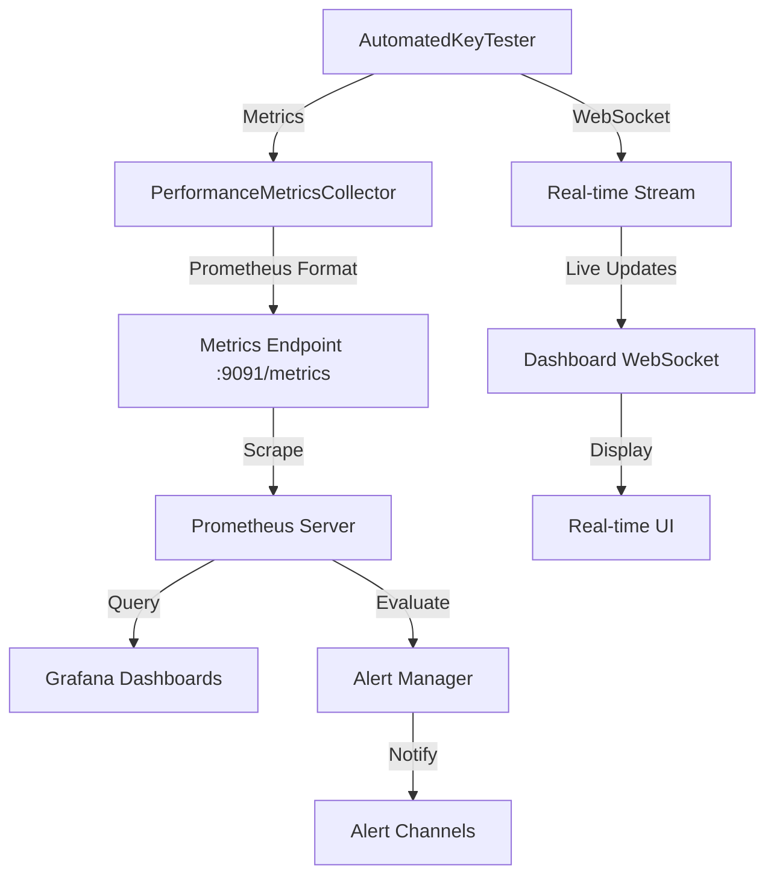

# Performance Monitoring Architecture for API Key Management

## Overview
Comprehensive performance monitoring system for the AutomatedKeyTester with real-time metrics collection, alerting, and visualization.

## Architecture Components

### 1. Metrics Collection Layer

#### Core Metrics Categories
- **Key Validation Performance**
  - `langfuse_key_validation_duration_ms` - Time taken to validate keys
  - `langfuse_key_validation_success_rate` - Percentage of successful validations
  - `langfuse_key_validation_errors_total` - Total validation errors

- **API Request/Response Metrics**
  - `langfuse_api_request_duration_ms` - Request latency histogram
  - `langfuse_api_request_rate` - Requests per second
  - `langfuse_api_response_size_bytes` - Response payload sizes
  - `langfuse_api_error_rate` - Error responses per second

- **Stress Testing Metrics**
  - `langfuse_stress_test_concurrent_traces` - Number of concurrent traces
  - `langfuse_stress_test_throughput_tps` - Traces per second
  - `langfuse_stress_test_latency_p95` - 95th percentile latency
  - `langfuse_stress_test_memory_usage_mb` - Memory consumption

- **System Resource Metrics**
  - `langfuse_cpu_usage_percent` - CPU utilization
  - `langfuse_memory_usage_mb` - Memory consumption
  - `langfuse_gc_pause_duration_ms` - Garbage collection pauses
  - `langfuse_connection_pool_active` - Active DB connections

### 2. Data Collection Implementation

```javascript
// Prometheus metrics collection
import { register, Counter, Histogram, Gauge, Summary } from 'prom-client';

class PerformanceMetricsCollector {
  constructor() {
    // Key validation metrics
    this.keyValidationDuration = new Histogram({
      name: 'langfuse_key_validation_duration_ms',
      help: 'Duration of key validation operations',
      buckets: [10, 50, 100, 250, 500, 1000, 2500, 5000]
    });

    this.keyValidationErrors = new Counter({
      name: 'langfuse_key_validation_errors_total',
      help: 'Total number of key validation errors',
      labelNames: ['error_type', 'test_suite']
    });

    // API performance metrics
    this.apiRequestDuration = new Histogram({
      name: 'langfuse_api_request_duration_ms',
      help: 'API request duration',
      labelNames: ['method', 'endpoint', 'status'],
      buckets: [10, 25, 50, 100, 250, 500, 1000, 2500, 5000, 10000]
    });

    // Stress test metrics
    this.concurrentTraces = new Gauge({
      name: 'langfuse_stress_test_concurrent_traces',
      help: 'Number of concurrent traces being processed'
    });

    this.traceThroughput = new Summary({
      name: 'langfuse_stress_test_throughput_tps',
      help: 'Traces processed per second',
      percentiles: [0.5, 0.9, 0.95, 0.99],
      maxAgeSeconds: 600,
      ageBuckets: 5
    });

    // Resource metrics
    this.memoryUsage = new Gauge({
      name: 'langfuse_memory_usage_mb',
      help: 'Current memory usage in MB',
      labelNames: ['type']
    });
  }

  // Collection methods
  recordKeyValidation(duration, success, errorType = null) {
    this.keyValidationDuration.observe(duration);
    if (!success && errorType) {
      this.keyValidationErrors.inc({ error_type: errorType });
    }
  }

  recordApiRequest(method, endpoint, status, duration) {
    this.apiRequestDuration.observe(
      { method, endpoint, status: status.toString() },
      duration
    );
  }

  updateConcurrentTraces(count) {
    this.concurrentTraces.set(count);
  }

  recordTraceThroughput(tracesPerSecond) {
    this.traceThroughput.observe(tracesPerSecond);
  }

  updateMemoryUsage() {
    const usage = process.memoryUsage();
    this.memoryUsage.set({ type: 'heap' }, usage.heapUsed / 1024 / 1024);
    this.memoryUsage.set({ type: 'rss' }, usage.rss / 1024 / 1024);
  }
}
```

### 3. Alert Thresholds and Rules

```yaml
# alerts/langfuse-performance.yml
groups:
  - name: langfuse_performance
    interval: 30s
    rules:
      # High latency alert
      - alert: HighKeyValidationLatency
        expr: histogram_quantile(0.95, langfuse_key_validation_duration_ms) > 1000
        for: 2m
        labels:
          severity: warning
        annotations:
          summary: "High key validation latency"
          description: "95th percentile latency is {{ $value }}ms"

      # Error rate alert
      - alert: HighValidationErrorRate
        expr: rate(langfuse_key_validation_errors_total[5m]) > 0.1
        for: 2m
        labels:
          severity: critical
        annotations:
          summary: "High key validation error rate"
          description: "Error rate is {{ $value }} errors/sec"

      # Throughput degradation
      - alert: LowTraceThroughput
        expr: langfuse_stress_test_throughput_tps < 100
        for: 5m
        labels:
          severity: warning
        annotations:
          summary: "Low trace throughput"
          description: "Throughput dropped to {{ $value }} TPS"

      # Memory pressure
      - alert: HighMemoryUsage
        expr: langfuse_memory_usage_mb{type="heap"} > 1024
        for: 5m
        labels:
          severity: warning
        annotations:
          summary: "High memory usage"
          description: "Heap usage is {{ $value }}MB"

      # API performance degradation
      - alert: APIResponseTimeDegradation
        expr: histogram_quantile(0.95, langfuse_api_request_duration_ms) > 2000
        for: 3m
        labels:
          severity: warning
        annotations:
          summary: "API response time degraded"
          description: "95th percentile API latency is {{ $value }}ms"
```

### 4. Monitoring Data Schemas

```typescript
// TypeScript schemas for monitoring data

interface PerformanceMetric {
  timestamp: number;
  metric_name: string;
  value: number;
  labels: Record<string, string>;
  unit: 'ms' | 'count' | 'percent' | 'bytes' | 'tps';
}

interface KeyValidationMetrics {
  validation_id: string;
  timestamp: number;
  duration_ms: number;
  success: boolean;
  error_type?: string;
  test_suite: string;
  key_type: 'public' | 'secret' | 'both';
}

interface StressTestMetrics {
  test_id: string;
  timestamp: number;
  concurrent_traces: number;
  total_traces: number;
  failed_traces: number;
  throughput_tps: number;
  latency_p50: number;
  latency_p95: number;
  latency_p99: number;
  memory_usage_mb: number;
  cpu_usage_percent: number;
}

interface APIPerformanceMetrics {
  request_id: string;
  timestamp: number;
  method: string;
  endpoint: string;
  status_code: number;
  duration_ms: number;
  request_size_bytes: number;
  response_size_bytes: number;
  error?: string;
}

interface AlertEvent {
  alert_id: string;
  timestamp: number;
  alert_name: string;
  severity: 'info' | 'warning' | 'critical';
  metric_value: number;
  threshold: number;
  duration_seconds: number;
  labels: Record<string, string>;
  annotations: Record<string, string>;
}
```

### 5. Grafana Dashboard Configuration

```json
{
  "dashboard": {
    "title": "Langfuse API Key Performance Monitoring",
    "panels": [
      {
        "title": "Key Validation Latency",
        "type": "graph",
        "targets": [
          {
            "expr": "histogram_quantile(0.95, langfuse_key_validation_duration_ms)",
            "legendFormat": "p95"
          },
          {
            "expr": "histogram_quantile(0.99, langfuse_key_validation_duration_ms)",
            "legendFormat": "p99"
          }
        ]
      },
      {
        "title": "API Request Rate",
        "type": "graph",
        "targets": [
          {
            "expr": "sum(rate(langfuse_api_request_duration_ms_count[1m])) by (endpoint)"
          }
        ]
      },
      {
        "title": "Stress Test Throughput",
        "type": "graph",
        "targets": [
          {
            "expr": "langfuse_stress_test_throughput_tps"
          }
        ]
      },
      {
        "title": "Error Rate by Type",
        "type": "graph",
        "targets": [
          {
            "expr": "sum(rate(langfuse_key_validation_errors_total[5m])) by (error_type)"
          }
        ]
      },
      {
        "title": "Memory Usage",
        "type": "graph",
        "targets": [
          {
            "expr": "langfuse_memory_usage_mb"
          }
        ]
      },
      {
        "title": "Concurrent Traces",
        "type": "stat",
        "targets": [
          {
            "expr": "langfuse_stress_test_concurrent_traces"
          }
        ]
      }
    ]
  }
}
```

### 6. Real-time Dashboard Data Flow



### 7. Integration with Existing Prometheus

```yaml
# Additional scrape config for prometheus.yml
  - job_name: 'langfuse-key-tester'
    static_configs:
      - targets: ['key-tester:9091']
    metrics_path: '/metrics'
    scrape_interval: 10s
    metric_relabel_configs:
      - source_labels: [__name__]
        regex: 'langfuse_.*'
        action: keep
```

### 8. Performance Optimization Recommendations

1. **Metric Cardinality Control**
   - Limit label combinations to prevent explosion
   - Use buckets appropriately for histograms
   - Aggregate where possible

2. **Collection Efficiency**
   - Batch metric updates
   - Use async collection for non-critical metrics
   - Implement metric buffering

3. **Storage Optimization**
   - Configure appropriate retention policies
   - Use recording rules for frequently queried metrics
   - Implement downsampling for historical data

4. **Alert Tuning**
   - Set appropriate evaluation intervals
   - Use multi-window alerts to reduce noise
   - Implement alert dependencies

### 9. Implementation Checklist

- [ ] Implement PerformanceMetricsCollector class
- [ ] Add metrics collection to AutomatedKeyTester
- [ ] Create Prometheus metrics endpoint
- [ ] Configure Prometheus scraping
- [ ] Create Grafana dashboards
- [ ] Set up alert rules
- [ ] Implement WebSocket real-time streaming
- [ ] Add metric buffering and batching
- [ ] Create performance baseline profiles
- [ ] Document metric definitions