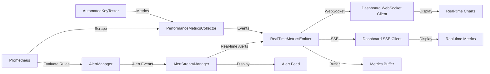

# Real-time Performance Monitoring Data Flow

## Architecture Overview

The real-time monitoring system provides instant visibility into API key validation performance through WebSocket connections and server-sent events (SSE).

## Components

### 1. Real-time Metrics Emitter

```javascript
// RealTimeMetricsEmitter.js
import { EventEmitter } from 'events';
import WebSocket from 'ws';
import { performance } from 'perf_hooks';

class RealTimeMetricsEmitter extends EventEmitter {
  constructor(options = {}) {
    super();
    this.wsPort = options.wsPort || 8081;
    this.ssePort = options.ssePort || 8082;
    this.metricsBuffer = [];
    this.bufferSize = options.bufferSize || 100;
    this.flushInterval = options.flushInterval || 1000;
    
    this.initWebSocketServer();
    this.initSSEServer();
    this.startMetricsFlush();
  }

  initWebSocketServer() {
    this.wss = new WebSocket.Server({ port: this.wsPort });
    
    this.wss.on('connection', (ws) => {
      console.log('New WebSocket client connected');
      
      // Send initial state
      ws.send(JSON.stringify({
        type: 'connection',
        timestamp: Date.now(),
        message: 'Connected to real-time metrics stream'
      }));
      
      // Handle client messages
      ws.on('message', (message) => {
        const data = JSON.parse(message);
        if (data.type === 'subscribe') {
          ws.subscriptions = data.metrics || ['all'];
        }
      });
      
      ws.on('close', () => {
        console.log('WebSocket client disconnected');
      });
    });
  }

  broadcastMetric(metric) {
    const message = JSON.stringify({
      type: 'metric',
      timestamp: Date.now(),
      data: metric
    });
    
    this.wss.clients.forEach((client) => {
      if (client.readyState === WebSocket.OPEN) {
        // Check if client subscribed to this metric type
        if (!client.subscriptions || 
            client.subscriptions.includes('all') || 
            client.subscriptions.includes(metric.name)) {
          client.send(message);
        }
      }
    });
  }

  emitMetric(metric) {
    // Add to buffer
    this.metricsBuffer.push({
      ...metric,
      emittedAt: Date.now()
    });
    
    // Trim buffer if needed
    if (this.metricsBuffer.length > this.bufferSize) {
      this.metricsBuffer.shift();
    }
    
    // Broadcast immediately for real-time
    this.broadcastMetric(metric);
    
    // Emit for local listeners
    this.emit('metric', metric);
  }
}
```

### 2. Dashboard WebSocket Integration

```typescript
// Real-time dashboard hook
import { useEffect, useState, useRef } from 'react';

interface MetricUpdate {
  type: string;
  timestamp: number;
  data: {
    name: string;
    value: number;
    labels: Record<string, string>;
    unit: string;
  };
}

export function useRealTimeMetrics(wsUrl: string, metrics: string[]) {
  const [connected, setConnected] = useState(false);
  const [latestMetrics, setLatestMetrics] = useState<Map<string, MetricUpdate>>(new Map());
  const [metricHistory, setMetricHistory] = useState<MetricUpdate[]>([]);
  const ws = useRef<WebSocket | null>(null);
  
  useEffect(() => {
    // Connect to WebSocket
    ws.current = new WebSocket(wsUrl);
    
    ws.current.onopen = () => {
      setConnected(true);
      // Subscribe to specific metrics
      ws.current?.send(JSON.stringify({
        type: 'subscribe',
        metrics: metrics
      }));
    };
    
    ws.current.onmessage = (event) => {
      const update: MetricUpdate = JSON.parse(event.data);
      
      if (update.type === 'metric') {
        // Update latest metric value
        setLatestMetrics(prev => {
          const newMap = new Map(prev);
          newMap.set(update.data.name, update);
          return newMap;
        });
        
        // Add to history
        setMetricHistory(prev => {
          const newHistory = [...prev, update];
          // Keep only last 1000 updates
          return newHistory.slice(-1000);
        });
      }
    };
    
    ws.current.onclose = () => {
      setConnected(false);
    };
    
    return () => {
      ws.current?.close();
    };
  }, [wsUrl, metrics]);
  
  return { connected, latestMetrics, metricHistory };
}
```

### 3. Real-time Alert Streaming

```javascript
// AlertStreamManager.js
class AlertStreamManager {
  constructor(alertManager, metricsEmitter) {
    this.alertManager = alertManager;
    this.metricsEmitter = metricsEmitter;
    this.activeAlerts = new Map();
    this.alertHistory = [];
    
    this.setupAlertHandlers();
  }

  setupAlertHandlers() {
    // Listen for alert state changes
    this.alertManager.on('alert-firing', (alert) => {
      this.handleAlertFiring(alert);
    });
    
    this.alertManager.on('alert-resolved', (alert) => {
      this.handleAlertResolved(alert);
    });
  }

  handleAlertFiring(alert) {
    const alertData = {
      id: alert.id,
      name: alert.name,
      severity: alert.severity,
      timestamp: Date.now(),
      state: 'firing',
      value: alert.value,
      threshold: alert.threshold,
      labels: alert.labels,
      annotations: alert.annotations
    };
    
    this.activeAlerts.set(alert.id, alertData);
    this.alertHistory.push(alertData);
    
    // Emit real-time alert
    this.metricsEmitter.emit('alert', {
      type: 'alert-firing',
      data: alertData
    });
  }

  handleAlertResolved(alert) {
    const activeAlert = this.activeAlerts.get(alert.id);
    if (activeAlert) {
      activeAlert.state = 'resolved';
      activeAlert.resolvedAt = Date.now();
      activeAlert.duration = activeAlert.resolvedAt - activeAlert.timestamp;
      
      this.activeAlerts.delete(alert.id);
      
      // Emit resolution
      this.metricsEmitter.emit('alert', {
        type: 'alert-resolved',
        data: activeAlert
      });
    }
  }
}
```

### 4. Data Flow Diagram



### 5. Metric Aggregation Pipeline

```javascript
// MetricAggregationPipeline.js
class MetricAggregationPipeline {
  constructor() {
    this.windows = {
      '1m': new SlidingWindow(60 * 1000),
      '5m': new SlidingWindow(5 * 60 * 1000),
      '15m': new SlidingWindow(15 * 60 * 1000)
    };
    
    this.aggregations = new Map();
  }

  processMetric(metric) {
    // Add to windows
    Object.values(this.windows).forEach(window => {
      window.add({
        timestamp: metric.timestamp,
        value: metric.value,
        name: metric.name
      });
    });
    
    // Calculate aggregations
    const aggregated = {
      name: metric.name,
      timestamp: Date.now(),
      current: metric.value,
      windows: {}
    };
    
    for (const [period, window] of Object.entries(this.windows)) {
      const values = window.getValues();
      if (values.length > 0) {
        aggregated.windows[period] = {
          min: Math.min(...values.map(v => v.value)),
          max: Math.max(...values.map(v => v.value)),
          avg: values.reduce((sum, v) => sum + v.value, 0) / values.length,
          count: values.length,
          rate: this.calculateRate(values)
        };
      }
    }
    
    this.aggregations.set(metric.name, aggregated);
    return aggregated;
  }

  calculateRate(values) {
    if (values.length < 2) return 0;
    
    const sorted = values.sort((a, b) => a.timestamp - b.timestamp);
    const timeDiff = (sorted[sorted.length - 1].timestamp - sorted[0].timestamp) / 1000;
    
    return values.length / timeDiff;
  }
}

class SlidingWindow {
  constructor(windowSize) {
    this.windowSize = windowSize;
    this.data = [];
  }

  add(item) {
    this.data.push(item);
    this.cleanup();
  }

  cleanup() {
    const cutoff = Date.now() - this.windowSize;
    this.data = this.data.filter(item => item.timestamp > cutoff);
  }

  getValues() {
    this.cleanup();
    return this.data;
  }
}
```

### 6. Real-time Dashboard Components

```typescript
// Real-time metric display component
interface RealTimeMetricProps {
  metricName: string;
  unit: string;
  threshold?: number;
  format?: (value: number) => string;
}

export function RealTimeMetric({ metricName, unit, threshold, format }: RealTimeMetricProps) {
  const { latestMetrics } = useRealTimeMetrics(WS_URL, [metricName]);
  const metric = latestMetrics.get(metricName);
  
  const value = metric?.data.value || 0;
  const formattedValue = format ? format(value) : value.toFixed(2);
  const isAboveThreshold = threshold && value > threshold;
  
  return (
    <div className={`metric-card ${isAboveThreshold ? 'alert' : ''}`}>
      <h3>{metricName}</h3>
      <div className="metric-value">
        <span className="value">{formattedValue}</span>
        <span className="unit">{unit}</span>
      </div>
      {threshold && (
        <div className="threshold">
          Threshold: {threshold} {unit}
        </div>
      )}
      <div className="timestamp">
        {metric && new Date(metric.timestamp).toLocaleTimeString()}
      </div>
    </div>
  );
}

// Real-time chart component
export function RealTimeChart({ metrics, timeWindow = '5m' }) {
  const { metricHistory } = useRealTimeMetrics(WS_URL, metrics);
  
  // Process history into chart data
  const chartData = useMemo(() => {
    return processMetricHistory(metricHistory, metrics, timeWindow);
  }, [metricHistory, metrics, timeWindow]);
  
  return (
    <LineChart
      data={chartData}
      width={800}
      height={400}
      margin={{ top: 5, right: 30, left: 20, bottom: 5 }}
    >
      <CartesianGrid strokeDasharray="3 3" />
      <XAxis dataKey="timestamp" tickFormatter={formatTimestamp} />
      <YAxis />
      <Tooltip />
      <Legend />
      {metrics.map((metric, index) => (
        <Line
          key={metric}
          type="monotone"
          dataKey={metric}
          stroke={COLORS[index % COLORS.length]}
          dot={false}
        />
      ))}
    </LineChart>
  );
}
```

### 7. Performance Optimization

1. **Metric Batching**: Buffer metrics and send in batches to reduce WebSocket message overhead
2. **Compression**: Use compression for WebSocket messages when payload size > 1KB
3. **Sampling**: For high-frequency metrics, implement adaptive sampling
4. **Client-side Aggregation**: Perform aggregations on the client to reduce server load
5. **Connection Pooling**: Reuse WebSocket connections across components

### 8. Implementation Checklist

- [ ] Implement RealTimeMetricsEmitter class
- [ ] Create WebSocket server for metrics streaming
- [ ] Implement SSE endpoint as fallback
- [ ] Create metric aggregation pipeline
- [ ] Build React hooks for real-time data
- [ ] Create real-time dashboard components
- [ ] Implement alert streaming
- [ ] Add metric buffering and batching
- [ ] Configure compression for large payloads
- [ ] Add connection health monitoring
- [ ] Create fallback mechanisms for connection failures
- [ ] Document WebSocket API
- [ ] Add authentication to WebSocket connections