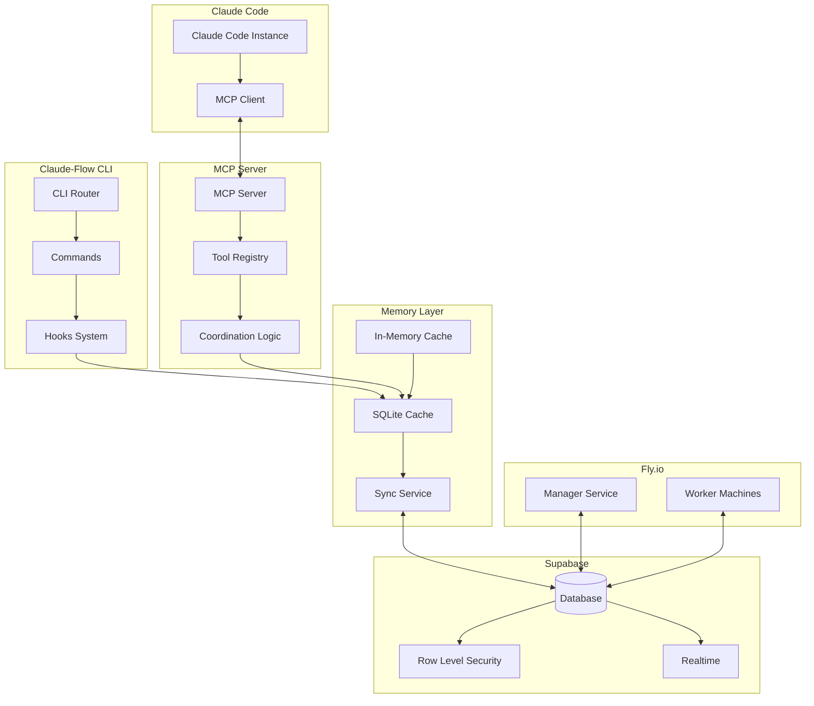

# Claude-Flow v2.0.0 Architecture Design

## Overview

Claude-Flow v2.0.0 is a distributed AI agent orchestration system that integrates with Claude Code to provide advanced coordination, memory persistence, and workflow automation capabilities. The architecture leverages existing infrastructure (Supabase database, Fly.io deployment) while adding a powerful CLI and MCP server layer.

## Core Components

### 1. CLI Architecture

```
claude-flow/
├── bin/
│   ├── claude-flow.js          # Main CLI entry point
│   └── claude-flow-mcp.js      # MCP server launcher
├── src/
│   ├── cli/
│   │   ├── index.ts            # CLI router & command registry
│   │   ├── commands/           # Command implementations
│   │   │   ├── swarm.ts        # Swarm management commands
│   │   │   ├── agent.ts        # Agent lifecycle commands
│   │   │   ├── task.ts         # Task orchestration commands
│   │   │   ├── memory.ts       # Memory persistence commands
│   │   │   ├── hooks.ts        # Hook management commands
│   │   │   ├── mcp.ts          # MCP server commands
│   │   │   └── github.ts       # GitHub integration commands
│   │   └── utils/
│   │       ├── logger.ts       # Unified logging
│   │       ├── config.ts       # Configuration management
│   │       └── telemetry.ts    # Usage analytics
│   ├── core/
│   │   ├── swarm/              # Swarm orchestration logic
│   │   ├── agent/              # Agent management
│   │   ├── task/               # Task execution engine
│   │   └── coordination/       # Inter-agent coordination
│   ├── database/
│   │   ├── client.ts           # Supabase client wrapper
│   │   ├── repositories/       # Data access layer
│   │   │   ├── swarm.ts
│   │   │   ├── worker.ts
│   │   │   ├── task.ts
│   │   │   └── memory.ts
│   │   └── migrations/         # Schema migrations
│   ├── mcp/
│   │   ├── server.ts           # MCP server implementation
│   │   ├── tools/              # MCP tool definitions
│   │   │   ├── swarm.ts        # Swarm management tools
│   │   │   ├── agent.ts        # Agent control tools
│   │   │   ├── memory.ts       # Memory access tools
│   │   │   └── neural.ts       # Neural network tools
│   │   └── transport.ts        # MCP transport layer
│   ├── hooks/
│   │   ├── manager.ts          # Hook registry & executor
│   │   ├── presets/            # Built-in hook presets
│   │   └── custom/             # User-defined hooks
│   ├── memory/
│   │   ├── store.ts            # Local SQLite memory store
│   │   ├── sync.ts             # Supabase sync logic
│   │   └── cache.ts            # In-memory cache layer
│   └── plugins/
│       ├── loader.ts           # Plugin system
│       └── api.ts              # Plugin API surface
├── templates/                  # Project templates
├── tests/                      # Test suite
└── package.json
```

### 2. Database Integration Layer

#### Mapping Swarm Concepts to Database Tables

```typescript
// Swarm Entity Mapping
interface SwarmMapping {
  // Swarm concept -> Database table
  swarm: 'swarms',              // Coordination topology
  agent: 'workers',             // Individual agents
  task: 'tasks',                // Orchestrated tasks
  memory: 'logs',               // Memory entries (metadata field)
  metrics: 'metrics',           // Performance metrics
  template: 'templates',        // Reusable configurations
}

// Extended Memory Storage
interface MemoryEntry extends LogEntry {
  metadata: {
    type: 'memory',
    namespace: string,
    key: string,
    value: any,
    ttl?: number,
    agent_id?: string,
    session_id?: string,
  }
}

// Agent Coordination State
interface AgentState extends Worker {
  config: {
    type: 'coordinator' | 'researcher' | 'coder' | 'analyst' | 'tester',
    capabilities: string[],
    cognitive_pattern?: string,
    coordination_hooks: string[],
  }
}
```

### 3. MCP Server Architecture

```typescript
// MCP Server Configuration
interface MCPServerConfig {
  name: "claude-flow",
  version: "2.0.0",
  transport: "stdio" | "websocket" | "http",
  tools: MCPTool[],
  resources: MCPResource[],
  prompts: MCPPrompt[],
}

// Tool Categories
interface ToolCategories {
  swarm: {
    swarm_init: InitializeSwarmTool,
    swarm_status: GetSwarmStatusTool,
    swarm_monitor: MonitorSwarmTool,
    swarm_destroy: DestroySwarmTool,
  },
  agent: {
    agent_spawn: SpawnAgentTool,
    agent_list: ListAgentsTool,
    agent_metrics: GetAgentMetricsTool,
  },
  task: {
    task_orchestrate: OrchestrateTaskTool,
    task_status: GetTaskStatusTool,
    task_results: GetTaskResultsTool,
  },
  memory: {
    memory_usage: MemoryOperationsTool,
    memory_search: SearchMemoryTool,
    memory_sync: SyncMemoryTool,
  },
  neural: {
    neural_status: GetNeuralStatusTool,
    neural_train: TrainNeuralPatternTool,
    neural_patterns: AnalyzePatternsTool,
  },
  github: {
    github_swarm: CreateGitHubSwarmTool,
    repo_analyze: AnalyzeRepositoryTool,
    pr_enhance: EnhancePullRequestTool,
  }
}
```

### 4. Hooks System Architecture

```typescript
// Hook Types
type HookType = 
  | 'pre-task' | 'post-task'
  | 'pre-edit' | 'post-edit'
  | 'pre-bash' | 'post-bash'
  | 'agent-spawned' | 'agent-completed'
  | 'session-start' | 'session-end'
  | 'mcp-initialized' | 'neural-trained';

// Hook Context
interface HookContext {
  type: HookType,
  timestamp: Date,
  agent?: AgentState,
  task?: TaskState,
  file?: FileOperation,
  command?: BashCommand,
  session?: SessionState,
  memory?: MemoryStore,
}

// Hook Registry
class HookManager {
  private hooks: Map<HookType, Hook[]>;
  private memory: MemoryStore;
  private telemetry: TelemetryService;
  
  async execute(type: HookType, context: HookContext): Promise<void> {
    // Pre-execution validation
    await this.validate(type, context);
    
    // Execute all registered hooks
    for (const hook of this.hooks.get(type) || []) {
      await hook.execute(context);
    }
    
    // Post-execution actions
    await this.postProcess(type, context);
  }
}
```

### 5. Agent Coordination Framework

```typescript
// Coordination Protocol
interface CoordinationProtocol {
  // Mandatory coordination points
  checkpoints: {
    PRE_TASK: 'pre-task',
    DURING_WORK: 'post-edit',
    DECISION_POINT: 'notify',
    TASK_COMPLETE: 'post-task',
  },
  
  // Shared memory channels
  channels: {
    DECISIONS: 'swarm/{swarm_id}/decisions',
    PROGRESS: 'swarm/{swarm_id}/progress',
    RESULTS: 'swarm/{swarm_id}/results',
    ERRORS: 'swarm/{swarm_id}/errors',
  },
  
  // Synchronization primitives
  sync: {
    locks: Map<string, AgentLock>,
    barriers: Map<string, Barrier>,
    semaphores: Map<string, Semaphore>,
  }
}

// Agent Lifecycle
class Agent {
  private id: string;
  private type: AgentType;
  private memory: MemoryStore;
  private coordinator: CoordinationService;
  
  async lifecycle(): Promise<void> {
    // 1. Initialize
    await this.initialize();
    
    // 2. Pre-task coordination
    await this.coordinator.checkpoint('pre-task', {
      agent: this.id,
      task: this.currentTask,
    });
    
    // 3. Execute task with coordination
    while (!this.taskComplete) {
      const work = await this.getNextWork();
      await this.executeWork(work);
      
      // Coordinate after each unit of work
      await this.coordinator.checkpoint('post-edit', {
        agent: this.id,
        work: work,
        progress: this.progress,
      });
    }
    
    // 4. Post-task coordination
    await this.coordinator.checkpoint('post-task', {
      agent: this.id,
      results: this.results,
    });
  }
}
```

### 6. Memory Persistence Layer

```typescript
// Memory Architecture
interface MemoryArchitecture {
  // Local SQLite for fast access
  local: {
    path: '.swarm/memory.db',
    schema: {
      memories: 'CREATE TABLE memories (...)',
      sessions: 'CREATE TABLE sessions (...)',
      coordination: 'CREATE TABLE coordination (...)',
    }
  },
  
  // Supabase for distributed persistence
  remote: {
    sync_interval: 30000, // 30 seconds
    batch_size: 100,
    conflict_resolution: 'last-write-wins',
  },
  
  // In-memory cache
  cache: {
    max_size: '100MB',
    ttl: 3600, // 1 hour
    eviction: 'lru',
  }
}

// Memory Operations
class MemoryStore {
  async store(key: string, value: any, options?: MemoryOptions): Promise<void> {
    // 1. Write to cache
    await this.cache.set(key, value, options?.ttl);
    
    // 2. Write to local SQLite
    await this.local.insert({
      key,
      value: JSON.stringify(value),
      namespace: options?.namespace || 'default',
      ttl: options?.ttl,
      created_at: new Date(),
    });
    
    // 3. Queue for remote sync
    await this.syncQueue.add({
      operation: 'store',
      key,
      value,
      timestamp: new Date(),
    });
  }
}
```

### 7. Plugin System Architecture

```typescript
// Plugin Interface
interface ClaudeFlowPlugin {
  name: string;
  version: string;
  
  // Lifecycle hooks
  onInstall?(): Promise<void>;
  onActivate?(): Promise<void>;
  onDeactivate?(): Promise<void>;
  
  // Extension points
  commands?: CommandDefinition[];
  hooks?: HookDefinition[];
  tools?: MCPToolDefinition[];
  agents?: AgentTypeDefinition[];
  
  // Configuration
  config?: PluginConfig;
}

// Plugin API
interface PluginAPI {
  // Core services
  swarm: SwarmService;
  memory: MemoryStore;
  coordinator: CoordinationService;
  telemetry: TelemetryService;
  
  // Extension registration
  registerCommand(command: CommandDefinition): void;
  registerHook(hook: HookDefinition): void;
  registerTool(tool: MCPToolDefinition): void;
  registerAgentType(agent: AgentTypeDefinition): void;
}
```

## Data Flow Architecture



## Implementation Phases

### Phase 1: Core CLI & Database Integration
1. Implement CLI command structure
2. Create Supabase client wrapper
3. Build data repositories
4. Add basic swarm/agent/task commands

### Phase 2: MCP Server Implementation
1. Implement stdio transport
2. Create tool registry
3. Map tools to database operations
4. Add coordination logic

### Phase 3: Hooks & Memory System
1. Build hook manager
2. Implement local SQLite store
3. Add Supabase sync logic
4. Create preset hooks

### Phase 4: Advanced Features
1. Plugin system
2. Neural pattern training
3. GitHub integration
4. Performance optimization

## Security Considerations

1. **Authentication**: Use Supabase Auth with RLS policies
2. **Command Validation**: Validate all bash commands through hooks
3. **Memory Isolation**: Namespace separation for multi-tenant usage
4. **Rate Limiting**: Implement at MCP and API levels
5. **Audit Logging**: Track all operations in logs table

## Performance Optimizations

1. **Batch Operations**: Group database operations
2. **Caching Strategy**: Multi-level cache (memory -> SQLite -> Supabase)
3. **Connection Pooling**: Reuse database connections
4. **Async Everything**: Non-blocking I/O throughout
5. **Lazy Loading**: Load plugins/tools on demand

## Monitoring & Telemetry

1. **Metrics Collection**: CPU, memory, task completion rates
2. **Error Tracking**: Sentry integration
3. **Usage Analytics**: Anonymous telemetry
4. **Performance Profiling**: Built-in profiler
5. **Health Checks**: Endpoint for monitoring