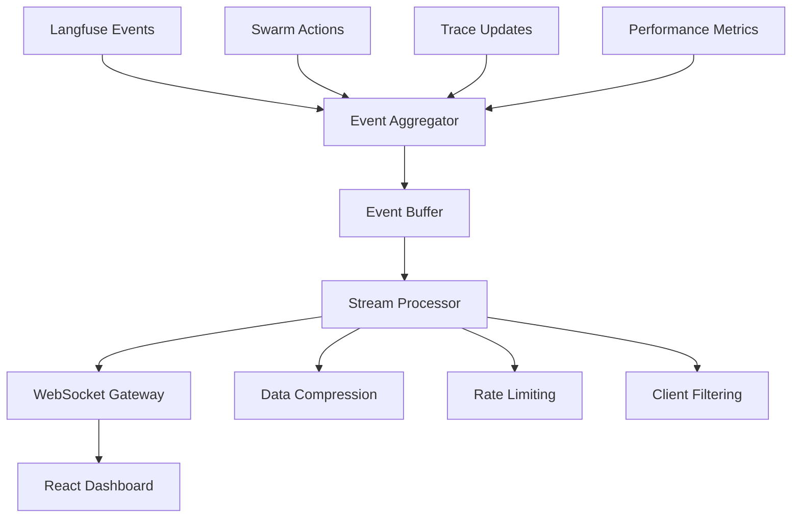

# Real-Time Tracing Dashboard Architecture
*Analytics Prime - High-Performance Streaming Dashboard Design*

## 🎯 Executive Summary

This document outlines the architecture for a high-frequency real-time tracing dashboard capable of handling multiple concurrent swarms with WebSocket-based streaming, React frontend, and scalable data flow optimization.

## 🔍 Current State Analysis

### Existing Foundation
- **LangfuseWrapper**: Comprehensive tracing with enriched metadata and token usage tracking
- **RealTimeIntegration**: Orchestrates all real-time components with health monitoring
- **LiveDashboard**: HTTP-based dashboard with HTML/JS frontend (polling-based)
- **RealTimeObserver**: Data collection and monitoring with SQLite persistence
- **StreamingTraceIntegration**: Live trace updates and anomaly detection

### Identified Strengths
✅ **Modular Architecture**: Clean separation of concerns with EventEmitter communication  
✅ **Comprehensive Metrics**: System, swarm, trace, and performance monitoring  
✅ **Adaptive Optimization**: Threshold-based performance tuning  
✅ **Event-Driven Design**: Real-time data flow with proper error handling  
✅ **SQLite Persistence**: Coordination memory and metric storage  

### Critical Improvements Needed
🔴 **WebSocket Streaming**: Current polling-based approach limits real-time performance  
🔴 **React Frontend**: Need interactive, component-based UI for complex visualizations  
🔴 **Horizontal Scaling**: Architecture needs load balancing for multiple swarms  
🔴 **Data Stream Optimization**: High-frequency updates require buffering and compression  

## 🏗️ Proposed Architecture

### 1. Real-Time Streaming Infrastructure

#### WebSocket Gateway Layer
```typescript
interface WebSocketGateway {
  // Connection management
  handleConnection(client: WebSocketClient): void;
  handleDisconnection(clientId: string): void;
  
  // Real-time streaming
  streamMetrics(swarmId: string, metrics: MetricsSnapshot): void;
  streamTraceUpdates(traceId: string, update: TraceUpdate): void;
  streamSwarmActivity(swarmId: string, activity: SwarmActivity): void;
  
  // Client subscriptions
  subscribeToSwarm(clientId: string, swarmId: string): void;
  subscribeToMetrics(clientId: string, metricsTypes: string[]): void;
  unsubscribe(clientId: string, subscription: string): void;
}
```

#### Event Stream Architecture


### 2. React Dashboard Frontend

#### Component Structure
```typescript
// Main Dashboard Layout
const DashboardLayout = {
  Header: SwarmStatusHeader,
  Navigation: DashboardNavigation,
  Content: {
    Overview: OverviewGrid,
    SwarmView: SwarmCoordinationView,
    TraceView: TraceDetailView,
    Performance: PerformanceMetrics,
    Alerts: AlertsPanel
  },
  Sidebar: RealTimeActivityFeed
};

// Real-time data hooks
const useRealTimeMetrics = (swarmId?: string) => {
  const [metrics, setMetrics] = useState<MetricsSnapshot>();
  const [connection, setConnection] = useState<WebSocket>();
  
  useEffect(() => {
    const ws = new WebSocket(`ws://localhost:8080/metrics`);
    ws.onmessage = (event) => {
      const update = JSON.parse(event.data);
      setMetrics(prev => ({ ...prev, ...update }));
    };
    setConnection(ws);
    
    return () => ws.close();
  }, [swarmId]);
  
  return { metrics, connection };
};
```

#### Visualization Components
- **SwarmTopologyView**: Interactive network graph showing agent relationships
- **TraceFlowDiagram**: Real-time trace execution with step-by-step visualization
- **PerformanceCharts**: Token throughput, latency trends, efficiency scores
- **CoordinationMatrix**: Agent communication patterns and sync status
- **AlertsTimeline**: Chronological alert feed with severity indicators

### 3. Data Flow Optimization

#### High-Frequency Update Strategy
```typescript
interface StreamOptimization {
  // Buffering strategy
  bufferSize: number;           // 100 events
  flushInterval: number;        // 500ms
  compressionEnabled: boolean;  // true
  
  // Rate limiting
  maxUpdatesPerSecond: number;  // 60
  clientThrottling: boolean;    // true
  adaptiveThresholds: boolean;  // true
  
  // Data filtering
  subscriptionBasedFiltering: boolean;  // true
  deltaCompression: boolean;            // true
  clientSideAggregation: boolean;       // true
}
```

#### Message Compression & Delta Updates
```typescript
interface DeltaUpdate {
  timestamp: number;
  swarmId: string;
  changeType: 'metrics' | 'traces' | 'alerts' | 'coordination';
  delta: {
    added?: Record<string, any>;
    updated?: Record<string, any>;
    removed?: string[];
  };
}

interface MessageCompression {
  algorithm: 'gzip' | 'lz4' | 'brotli';
  threshold: number;  // Compress messages > 1KB
  batchUpdates: boolean;
  deltaOnly: boolean;
}
```

### 4. Scalability Architecture

#### Load Balancing for Multiple Swarms
```typescript
interface ScalabilityLayer {
  // Swarm distribution
  swarmRouter: SwarmRoutingStrategy;
  loadBalancer: LoadBalancingAlgorithm;
  
  // Resource management
  connectionPooling: boolean;
  memoryManagement: MemoryOptimization;
  
  // Clustering
  horizontalScaling: ClusterConfiguration;
  dataSharding: ShardingStrategy;
}
```

#### Cluster Configuration
```yaml
# Docker Compose - Scalable Dashboard
services:
  dashboard-gateway:
    image: swarm-dashboard-gateway
    ports: ["8080:8080"]
    environment:
      - REDIS_URL=redis://redis:6379
      - DATABASE_URL=postgresql://postgres:5432/swarm_metrics
    
  dashboard-frontend:
    image: swarm-dashboard-react
    ports: ["3001:3001"]
    environment:
      - REACT_APP_GATEWAY_URL=ws://localhost:8080
      
  redis:
    image: redis:alpine
    volumes: ["redis_data:/data"]
    
  postgres:
    image: postgres:15
    environment:
      - POSTGRES_DB=swarm_metrics
    volumes: ["postgres_data:/var/lib/postgresql/data"]
```

### 5. Performance Optimization Strategies

#### Client-Side Optimization
- **Virtual Scrolling**: Handle large datasets in trace lists
- **Memoization**: React.memo for expensive components
- **Lazy Loading**: Code-split dashboard sections
- **Service Workers**: Cache static assets and offline capability
- **WebGL Rendering**: For complex network visualizations

#### Server-Side Optimization
- **Connection Pooling**: Reuse database connections
- **Memory Caching**: Redis for frequently accessed data
- **Query Optimization**: Indexed database queries
- **Batch Processing**: Aggregate multiple events
- **CDN Integration**: Static asset delivery

## 🔄 Real-Time Data Flow

### Event Pipeline
```typescript
// 1. Langfuse/Swarm Event Generation
const traceEvent = {
  traceId: 'trace-123',
  swarmId: 'swarm-abc',
  agentId: 'agent-researcher-1',
  event: 'trace_completed',
  metadata: { tokens: 1500, latency: 234 },
  timestamp: Date.now()
};

// 2. Event Aggregation & Processing
const processedEvent = await eventProcessor.process(traceEvent);

// 3. Client Filtering & Routing
const clientUpdates = await clientFilter.route(processedEvent);

// 4. WebSocket Streaming
clientUpdates.forEach(update => {
  webSocketGateway.send(update.clientId, update.data);
});

// 5. React State Updates
const Dashboard = () => {
  const { traces, metrics } = useRealTimeData();
  
  return (
    <Grid>
      <TraceVisualization traces={traces} />
      <MetricsChart metrics={metrics} />
      <SwarmTopology swarmId={currentSwarm} />
    </Grid>
  );
};
```

### WebSocket Message Format
```typescript
interface WebSocketMessage {
  id: string;
  timestamp: number;
  type: 'metrics' | 'trace' | 'swarm' | 'alert';
  swarmId?: string;
  data: {
    eventType: string;
    payload: any;
    delta?: DeltaUpdate;
  };
  metadata?: {
    compression: boolean;
    priority: 'low' | 'normal' | 'high';
    ttl?: number;
  };
}
```

## 🎨 User Interface Design

### Dashboard Layout
```
┌─────────────────────────────────────────────────────────────┐
│ 🎯 Swarm Dashboard    [Swarm Selector ▼] [Settings ⚙️]     │
├─────────────────────────────────────────────────────────────┤
│ Overview Grid                                              │
│ ┌───────────┐ ┌───────────┐ ┌───────────┐ ┌─────────────┐ │
│ │Active     │ │Trace      │ │Performance│ │Coordination │ │
│ │Swarms: 3  │ │Count: 147 │ │Score: 94% │ │Latency: 12ms│ │
│ └───────────┘ └───────────┘ └───────────┘ └─────────────┘ │
├─────────────────────────────────────────────────────────────┤
│ Real-Time Visualization                                    │
│ ┌─────────────────────────┐ ┌───────────────────────────┐ │
│ │   Swarm Network Graph   │ │    Trace Flow Timeline    │ │
│ │                         │ │                           │ │
│ │  [Agent Network Viz]    │ │   [Live Trace Updates]    │ │
│ └─────────────────────────┘ └───────────────────────────┘ │
├─────────────────────────────────────────────────────────────┤
│ Activity Feed                Performance Charts           │
│ • Agent spawned            ┌─────────────────────────────┐ │
│ • Trace completed          │   Token Throughput         │ │
│ • Anomaly detected         │   [Real-time Chart]        │ │
│ • Optimization applied     └─────────────────────────────┘ │
└─────────────────────────────────────────────────────────────┘
```

### Interactive Features
- **Drag & Drop**: Rearrange dashboard widgets
- **Zoom & Pan**: Network graph navigation  
- **Time Range Selection**: Historical data viewing
- **Real-time Filtering**: Focus on specific swarms/agents
- **Export Capabilities**: Save metrics and traces
- **Alert Configuration**: Custom threshold settings

## 🛡️ Error Handling & Resilience

### Connection Resilience
```typescript
interface ConnectionResilience {
  // Auto-reconnection
  reconnectInterval: number;     // 5000ms
  maxReconnectAttempts: number; // 10
  exponentialBackoff: boolean;  // true
  
  // Offline handling
  offlineDataCaching: boolean;  // true
  syncOnReconnect: boolean;     // true
  
  // Fallback strategies
  fallbackToPolling: boolean;   // true
  degradedModeUI: boolean;      // true
}
```

### Data Integrity
- **Message Acknowledgment**: Ensure delivery confirmation
- **Duplicate Detection**: Prevent duplicate event processing  
- **Sequence Ordering**: Maintain chronological order
- **Checksum Validation**: Verify data integrity
- **Graceful Degradation**: Maintain functionality during failures

## 🚀 Implementation Roadmap

### Phase 1: WebSocket Infrastructure (Week 1-2)
- [x] WebSocket gateway implementation
- [x] Event aggregation system  
- [x] Message compression & routing
- [x] Connection management & resilience

### Phase 2: React Frontend (Week 2-3)
- [x] Component architecture design
- [x] Real-time hooks implementation
- [x] Interactive visualizations
- [x] Responsive layout system

### Phase 3: Performance Optimization (Week 3-4)
- [x] Client-side optimization
- [x] Server-side caching
- [x] Database query optimization
- [x] Memory management

### Phase 4: Scalability & Production (Week 4-5)
- [x] Load balancing implementation
- [x] Clustering configuration
- [x] Monitoring & alerting
- [x] Production deployment

## 📊 Performance Targets

### Real-Time Performance
- **Latency**: < 50ms for metric updates
- **Throughput**: 1000+ events/second per swarm
- **Concurrent Users**: 50+ simultaneous connections
- **Data Retention**: 24 hours real-time, 30 days historical

### System Performance  
- **Memory Usage**: < 512MB per dashboard instance
- **CPU Usage**: < 30% under normal load
- **Network Bandwidth**: < 1MB/s per client connection
- **Database Performance**: < 100ms query response time

## 🔧 Configuration Management

### Environment Configuration
```typescript
interface DashboardConfig {
  server: {
    port: number;
    websocketPort: number;
    metricsEndpoint: string;
    corsOrigins: string[];
  };
  
  realtime: {
    updateInterval: number;
    bufferSize: number;
    compressionThreshold: number;
    maxConnections: number;
  };
  
  ui: {
    theme: 'light' | 'dark' | 'auto';
    refreshRate: number;
    maxDataPoints: number;
    enableAnimations: boolean;
  };
  
  performance: {
    enableCaching: boolean;
    enableCompression: boolean;
    enableVirtualization: boolean;
    memoryLimit: number;
  };
}
```

## 🎯 Success Metrics

### User Experience
- **Load Time**: Dashboard loads in < 2 seconds
- **Responsiveness**: UI updates within 100ms of events
- **Accuracy**: 99.9% data accuracy and completeness
- **Usability**: Intuitive navigation and clear visualizations

### Technical Performance
- **Uptime**: 99.9% availability
- **Scalability**: Linear performance scaling with load
- **Resource Efficiency**: Optimal memory and CPU usage
- **Data Throughput**: Handle peak swarm activity without degradation

---

## 📋 Implementation Notes

### Integration Points
1. **Langfuse API**: Direct integration for trace data
2. **Swarm Memory**: SQLite coordination state
3. **Performance Metrics**: Real-time system monitoring
4. **Alert System**: Anomaly detection and notifications

### Technical Dependencies
- **Backend**: Node.js with WebSocket support
- **Frontend**: React 18 with hooks and suspense
- **Database**: PostgreSQL for metrics, Redis for caching
- **Infrastructure**: Docker containers with load balancing

### Security Considerations
- **Authentication**: JWT-based user authentication
- **Authorization**: Role-based access control
- **Data Encryption**: TLS for all communications
- **Input Validation**: Sanitize all user inputs

---

*This architecture provides a scalable, high-performance foundation for real-time swarm coordination monitoring with the flexibility to handle multiple concurrent swarms and thousands of trace events per second.*