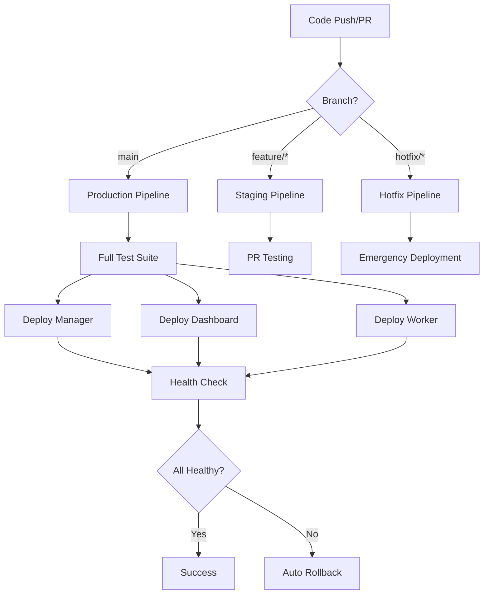

# Deployment Pipeline Implementation Guide

## 🚀 Implementation Status

The comprehensive deployment pipeline architecture has been designed and implemented with the following components:

### ✅ Completed Components

#### 1. GitHub Actions Workflows
- **Production Deployment** (`.github/workflows/deploy-production.yml`)
  - Automated deployment to all platforms
  - Parallel execution strategy
  - Comprehensive health checks
  - Automatic rollback on failure
  
- **Staging Deployment** (`.github/workflows/staging-deployment.yml`)
  - PR-based staging deployments
  - Automated testing pipeline
  - Preview environments
  - Auto-cleanup on PR close
  
- **Manual Rollback** (`.github/workflows/manual-rollback.yml`)
  - Emergency rollback capabilities
  - Confirmation safeguards
  - Audit trail logging
  - Multi-service rollback support

#### 2. Environment Configurations
- **Production Environment** (`.github/environments/production.yml`)
  - Approval requirements
  - Security thresholds
  - SLA definitions
  - Deployment windows
  
- **Staging Environment** (`.github/environments/staging.yml`)
  - Rapid iteration support
  - Automated testing
  - Resource limitations
  - Auto-cleanup policies

#### 3. Operational Scripts
- **Emergency Rollback** (`scripts/emergency-rollback.sh`)
  - One-command rollback capability
  - Service-specific rollback
  - Dry-run support
  - Comprehensive logging
  
- **Deployment Validator** (`scripts/deployment-validator.sh`)
  - Pre/post deployment validation
  - Performance testing
  - Health checking
  - Multiple output formats

## 🎯 Deployment Targets & Strategy

### Platform-Specific Deployments

#### Manager API → Fly.io
- **App Name**: `swarm-manager-live`
- **Strategy**: Blue-green deployment with health checks
- **Scaling**: Auto-scaling based on CPU/memory usage
- **Monitoring**: Real-time health checks every 30 seconds

#### Dashboard → Vercel
- **Strategy**: Atomic deployments with instant rollback
- **CDN**: Global edge distribution
- **Preview**: PR-based preview deployments
- **Performance**: Automatic optimization and caching

#### Worker Service → Fly.io
- **App Name**: `swarm-worker`
- **Strategy**: Rolling deployment with queue management
- **Scaling**: Dynamic scaling based on queue length
- **Monitoring**: Worker health and performance metrics

## 🔄 CI/CD Pipeline Flow

### Trigger Conditions



### Parallel Deployment Strategy

The pipeline deploys all services in parallel for maximum efficiency:

1. **Validation Phase** (2-5 minutes)
   - Lint checking
   - Type validation
   - Unit tests
   - Security scans

2. **Build Phase** (3-8 minutes)
   - Parallel builds for all services
   - Dependency validation
   - Asset optimization

3. **Deployment Phase** (5-15 minutes)
   - Parallel deployments to all platforms
   - Health check orchestration
   - Performance validation

4. **Validation Phase** (2-5 minutes)
   - Integration testing
   - Performance benchmarking
   - Security verification

## 🔧 Configuration Requirements

### Required GitHub Secrets

```yaml
# Fly.io Configuration
FLY_API_TOKEN: "your-fly-api-token"

# Vercel Configuration
VERCEL_TOKEN: "your-vercel-token"
VERCEL_ORG_ID: "your-org-id"
VERCEL_PROJECT_ID: "your-project-id"

# Supabase Configuration
SUPABASE_URL: "https://your-project.supabase.co"
SUPABASE_ANON_KEY: "your-anon-key"
SUPABASE_SERVICE_KEY: "your-service-role-key"

# Redis Configuration
REDIS_URL: "redis://your-redis-host:6379"

# Observability Configuration
LANGFUSE_SECRET_KEY: "sk_lf_your-secret-key"
LANGFUSE_PUBLIC_KEY: "pk_lf_your-public-key"

# Notification Configuration (Optional)
SLACK_WEBHOOK_URL: "your-slack-webhook"
PAGERDUTY_INTEGRATION_KEY: "your-pagerduty-key"
```

### Environment Variables by Service

#### Manager API
```env
NODE_ENV=production
PORT=8080
FLY_API_TOKEN=${FLY_API_TOKEN}
SUPABASE_URL=${SUPABASE_URL}
SUPABASE_ANON_KEY=${SUPABASE_ANON_KEY}
REDIS_URL=${REDIS_URL}
LANGFUSE_SECRET_KEY=${LANGFUSE_SECRET_KEY}
LANGFUSE_PUBLIC_KEY=${LANGFUSE_PUBLIC_KEY}
```

#### Dashboard
```env
VITE_MANAGER_URL=https://swarm-manager-live.fly.dev
VITE_WS_URL=wss://swarm-manager-live.fly.dev
VITE_SUPABASE_URL=${SUPABASE_URL}
VITE_SUPABASE_ANON_KEY=${SUPABASE_ANON_KEY}
```

#### Worker Service
```env
NODE_ENV=production
PORT=8000
REDIS_URL=${REDIS_URL}
SUPABASE_URL=${SUPABASE_URL}
SUPABASE_ANON_KEY=${SUPABASE_ANON_KEY}
```

## 🔍 Testing Gates & Validation

### Pre-Deployment Gates

1. **Code Quality**
   - ESLint passing
   - TypeScript compilation
   - Code coverage > 80%

2. **Security**
   - Dependency audit
   - Secret scanning
   - Vulnerability assessment

3. **Build Validation**
   - All packages build successfully
   - No build warnings/errors
   - Asset optimization complete

### Post-Deployment Validation

1. **Health Checks**
   - HTTP status 200 on health endpoints
   - Database connectivity
   - Redis connectivity

2. **Performance Benchmarks**
   - Response time < 500ms
   - Error rate < 1%
   - Memory usage < 80%

3. **Integration Tests**
   - API → Dashboard communication
   - WebSocket connectivity
   - Real-time features working

## 🚨 Rollback & Recovery Mechanisms

### Automatic Rollback Triggers

1. **Health Check Failures**
   - 3 consecutive failed health checks
   - Service unavailable for > 60 seconds

2. **Performance Degradation**
   - Response time > 2x baseline
   - Error rate > 5%
   - Memory usage > 90%

3. **Integration Failures**
   - Failed post-deployment tests
   - Database connectivity issues
   - Critical API endpoints failing

### Manual Rollback Procedures

#### Emergency Rollback Command
```bash
# Rollback all services
./scripts/emergency-rollback.sh --service all --reason "critical-bug" --confirm

# Rollback specific service
./scripts/emergency-rollback.sh --service manager --reason "api-failure"

# Dry run to see what would happen
./scripts/emergency-rollback.sh --service dashboard --reason "test" --dry-run
```

#### GitHub Actions Manual Rollback
```yaml
# Use the Manual Rollback workflow in GitHub Actions
# 1. Go to Actions tab
# 2. Select "Manual Rollback" workflow
# 3. Click "Run workflow"
# 4. Select service and provide reason
# 5. Type "CONFIRM" to proceed
```

## 📊 Monitoring & Observability

### Real-time Monitoring

1. **Health Dashboards**
   - Service status overview
   - Response time metrics
   - Error rate tracking
   - Resource utilization

2. **Deployment Tracking**
   - Deployment frequency
   - Success/failure rates
   - Rollback incidents
   - Performance trends

3. **Alert Configuration**
   - Critical: Service down (immediate)
   - Warning: Performance degradation (5 min)
   - Info: Deployment completed (notification)

### Key Metrics

```yaml
# SLA Targets
uptime: "99.9%"
response_time: "< 200ms"
error_rate: "< 0.1%"
deployment_frequency: "multiple times per day"
lead_time: "< 1 hour"
mttr: "< 15 minutes"
```

## 🔐 Security Integration

### Security Scanning Pipeline

1. **Dependency Scanning**
   - npm audit for vulnerabilities
   - retire.js for deprecated packages
   - Snyk integration (optional)

2. **Container Scanning**
   - Trivy for container vulnerabilities
   - Base image security validation

3. **Secret Scanning**
   - GitLeaks for exposed secrets
   - Pre-commit hooks for prevention

4. **Code Analysis**
   - SemGrep for security patterns
   - CodeQL for vulnerability detection

### Security Gates

- **Block deployment** on critical vulnerabilities
- **Warn on medium** vulnerabilities
- **Track and remediate** all findings
- **Regular security reviews** and updates

## 🚀 Next Steps for Implementation

### Phase 1: Setup (Week 1)
- [ ] Configure GitHub repository secrets
- [ ] Set up environment protection rules
- [ ] Test workflows in staging environment
- [ ] Configure monitoring dashboards

### Phase 2: Production Rollout (Week 2)
- [ ] Execute first production deployment
- [ ] Validate all monitoring and alerts
- [ ] Test rollback procedures
- [ ] Train team on new processes

### Phase 3: Optimization (Week 3)
- [ ] Fine-tune performance thresholds
- [ ] Optimize deployment times
- [ ] Add advanced monitoring
- [ ] Implement chaos testing

### Phase 4: Advanced Features (Week 4)
- [ ] Blue-green deployment strategy
- [ ] Feature flag integration
- [ ] Advanced security scanning
- [ ] Performance optimization

## 📚 Documentation & Training

### Team Training Materials
- Deployment pipeline overview
- Emergency procedures handbook
- Monitoring dashboard guide
- Troubleshooting runbook

### Runbooks
- Standard deployment procedure
- Emergency rollback procedure
- Performance issue investigation
- Security incident response

## 🎯 Expected Outcomes

With this comprehensive deployment pipeline:

1. **Zero Downtime Deployments**: Automated blue-green strategy
2. **Rapid Recovery**: < 2 minute rollback capability
3. **High Reliability**: 99.9% uptime target
4. **Enhanced Security**: Integrated security scanning
5. **Performance Assurance**: Automated performance validation
6. **Operational Excellence**: Comprehensive monitoring and alerting

The pipeline is designed to scale with your team and support rapid, reliable deployments while maintaining the highest standards of quality and security.