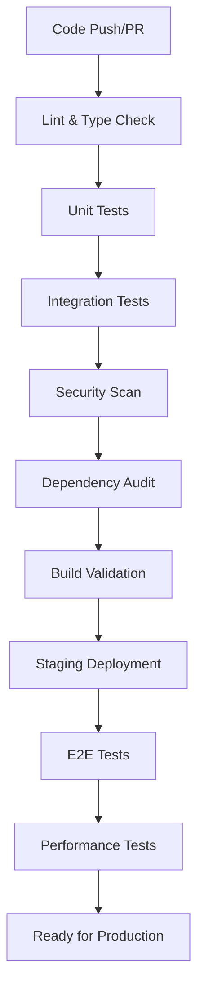
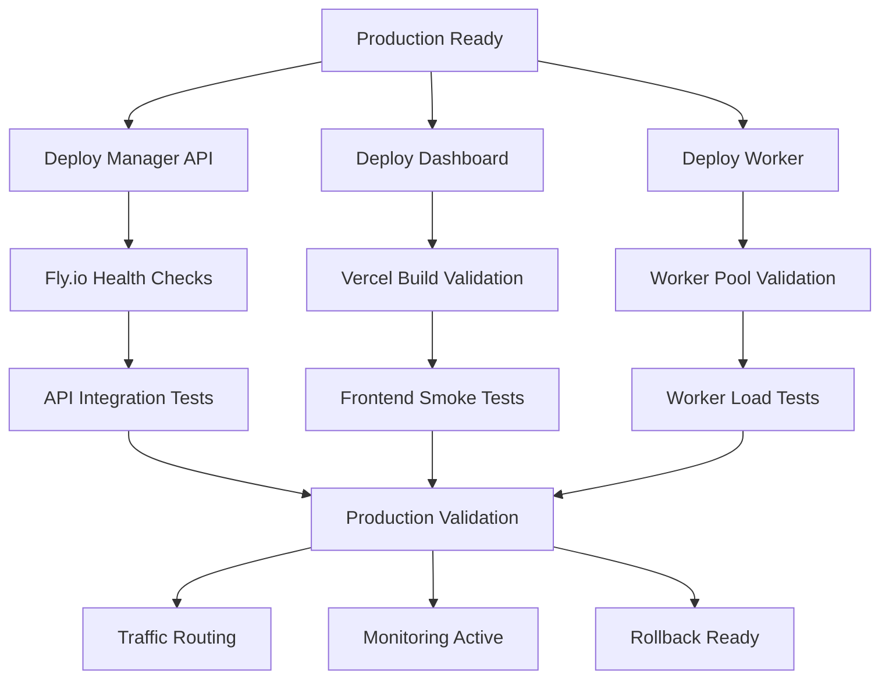

# Comprehensive Deployment Pipeline Architecture

## 🏗️ Architecture Overview

This deployment pipeline enables **zero-downtime, fully automated deployments** across multiple platforms with comprehensive testing, validation, and rollback capabilities.

### 🎯 Deployment Targets
- **Manager API**: TypeScript/Express → Fly.io (High-availability multi-region)
- **Dashboard**: React/Vite → Vercel (Global CDN distribution)
- **Worker Service**: TypeScript workers → Fly.io (Auto-scaling compute)

### 🔄 Pipeline Triggers
- **Push to main**: Full production deployment
- **Pull Request**: Staging environment + automated testing
- **Git Tags**: Release versioning + production deployment
- **Manual Dispatch**: Emergency deployments with approval gates

## 🚀 Multi-Platform Deployment Strategy

### Stage 1: Pre-Deployment Validation


### Stage 2: Parallel Production Deployment


## 📋 GitHub Actions Pipeline Implementation

### Core Workflow Structure

#### 1. Main Pipeline (`.github/workflows/deploy-production.yml`)
```yaml
name: 🚀 Production Deployment Pipeline

on:
  push:
    branches: [main]
  workflow_dispatch:
    inputs:
      deploy_manager:
        description: 'Deploy Manager API'
        type: boolean
        default: true
      deploy_dashboard:
        description: 'Deploy Dashboard'
        type: boolean
        default: true
      deploy_worker:
        description: 'Deploy Worker Service'
        type: boolean
        default: true
      environment:
        description: 'Deployment Environment'
        type: choice
        options: ['production', 'staging']
        default: 'production'

env:
  NODE_VERSION: '18'
  DEPLOYMENT_ID: ${{ github.run_id }}-${{ github.run_attempt }}

jobs:
  validate:
    name: 🔍 Pre-Deployment Validation
    runs-on: ubuntu-latest
    outputs:
      should_deploy: ${{ steps.changes.outputs.should_deploy }}
      manager_changed: ${{ steps.changes.outputs.manager }}
      dashboard_changed: ${{ steps.changes.outputs.dashboard }}
      worker_changed: ${{ steps.changes.outputs.worker }}
    
    steps:
      - name: 📦 Checkout
        uses: actions/checkout@v4
        with:
          fetch-depth: 2
      
      - name: 🔍 Detect Changes
        id: changes
        uses: dorny/paths-filter@v2
        with:
          filters: |
            manager:
              - 'apps/manager/**'
              - 'shared/**'
              - 'package.json'
              - 'pnpm-lock.yaml'
            dashboard:
              - 'admin-dashboard/**'
              - 'shared/types/**'
            worker:
              - 'apps/worker/**'
              - 'shared/**'
            should_deploy:
              - 'apps/**'
              - 'shared/**'
              - '.github/workflows/**'
      
      - name: 🟢 Setup Node.js
        uses: actions/setup-node@v4
        with:
          node-version: ${{ env.NODE_VERSION }}
          cache: 'pnpm'
      
      - name: 📦 Install pnpm
        run: npm install -g pnpm
      
      - name: 📥 Install Dependencies
        run: pnpm install --frozen-lockfile
      
      - name: 🔍 Lint & Type Check
        run: |
          pnpm run lint
          pnpm run type-check
      
      - name: 🧪 Unit Tests
        run: pnpm run test:unit --coverage
      
      - name: 🔐 Security Scan
        run: |
          pnpm audit --fix=false
          npx retire --exitwith 1
      
      - name: 🏗️ Build All Packages
        run: pnpm run build

  test-integration:
    name: 🧪 Integration Testing
    needs: validate
    if: needs.validate.outputs.should_deploy == 'true'
    runs-on: ubuntu-latest
    
    services:
      redis:
        image: redis:7-alpine
        ports:
          - 6379:6379
        options: >-
          --health-cmd "redis-cli ping"
          --health-interval 10s
          --health-timeout 5s
          --health-retries 5
    
    steps:
      - name: 📦 Checkout
        uses: actions/checkout@v4
      
      - name: 🟢 Setup Node.js
        uses: actions/setup-node@v4
        with:
          node-version: ${{ env.NODE_VERSION }}
          cache: 'pnpm'
      
      - name: 📦 Install pnpm
        run: npm install -g pnpm
      
      - name: 📥 Install Dependencies
        run: pnpm install --frozen-lockfile
      
      - name: 🏗️ Build for Testing
        run: pnpm run build
      
      - name: 🧪 Integration Tests
        run: pnpm run test:integration
        env:
          REDIS_URL: redis://localhost:6379
          NODE_ENV: test
          
      - name: 🎭 E2E Tests
        run: pnpm run test:e2e
        env:
          CI: true

  deploy-staging:
    name: 🚧 Staging Deployment
    needs: [validate, test-integration]
    if: needs.validate.outputs.should_deploy == 'true' && github.event_name == 'pull_request'
    runs-on: ubuntu-latest
    environment: staging
    
    steps:
      - name: 📦 Checkout
        uses: actions/checkout@v4
      
      - name: 🚧 Deploy to Staging
        run: |
          echo "🚧 Deploying to staging environment..."
          # Staging deployment logic here

  deploy-manager:
    name: 🖥️ Deploy Manager API
    needs: [validate, test-integration]
    if: needs.validate.outputs.manager_changed == 'true' || github.event.inputs.deploy_manager == 'true'
    runs-on: ubuntu-latest
    environment: production
    
    steps:
      - name: 📦 Checkout
        uses: actions/checkout@v4
      
      - name: 🛠️ Setup Fly CLI
        uses: superfly/flyctl-actions/setup-flyctl@master
        with:
          version: latest
      
      - name: 🏗️ Build and Deploy Manager
        working-directory: apps/manager
        run: |
          echo "🚀 Deploying Manager API to Fly.io..."
          flyctl deploy --app swarm-manager-live --build-arg NODE_ENV=production
        env:
          FLY_API_TOKEN: ${{ secrets.FLY_API_TOKEN }}
      
      - name: ⏱️ Wait for Deployment
        run: |
          echo "⏱️ Waiting for deployment to stabilize..."
          sleep 30
      
      - name: 🩺 Health Check
        run: |
          echo "🩺 Performing health check..."
          max_attempts=30
          attempt=1
          
          while [ $attempt -le $max_attempts ]; do
            if curl -f https://swarm-manager-live.fly.dev/health; then
              echo "✅ Health check passed!"
              break
            else
              echo "❌ Health check failed (attempt $attempt/$max_attempts)"
              if [ $attempt -eq $max_attempts ]; then
                echo "💥 Deployment failed - health check never passed"
                exit 1
              fi
              sleep 10
              attempt=$((attempt + 1))
            fi
          done
      
      - name: 🧪 Post-Deployment Tests
        run: |
          echo "🧪 Running post-deployment API tests..."
          curl -X POST https://swarm-manager-live.fly.dev/api/swarms/test \
            -H "Content-Type: application/json" \
            -d '{"name": "deployment-test", "type": "test"}'

  deploy-dashboard:
    name: 🎨 Deploy Dashboard
    needs: [validate, test-integration]
    if: needs.validate.outputs.dashboard_changed == 'true' || github.event.inputs.deploy_dashboard == 'true'
    runs-on: ubuntu-latest
    environment: production
    
    steps:
      - name: 📦 Checkout
        uses: actions/checkout@v4
      
      - name: 🟢 Setup Node.js
        uses: actions/setup-node@v4
        with:
          node-version: ${{ env.NODE_VERSION }}
          cache: 'pnpm'
      
      - name: 📦 Install pnpm
        run: npm install -g pnpm
      
      - name: 📥 Install Dependencies
        working-directory: admin-dashboard
        run: pnpm install --frozen-lockfile
      
      - name: 🏗️ Build Dashboard
        working-directory: admin-dashboard
        run: |
          echo "🏗️ Building dashboard for production..."
          pnpm run build
        env:
          NEXT_PUBLIC_MANAGER_URL: https://swarm-manager-live.fly.dev
          NEXT_PUBLIC_WS_URL: wss://swarm-manager-live.fly.dev
          NEXT_PUBLIC_SUPABASE_URL: ${{ secrets.SUPABASE_URL }}
          NEXT_PUBLIC_SUPABASE_ANON_KEY: ${{ secrets.SUPABASE_ANON_KEY }}
      
      - name: 🚀 Deploy to Vercel
        uses: amondnet/vercel-action@v25
        with:
          vercel-token: ${{ secrets.VERCEL_TOKEN }}
          vercel-org-id: ${{ secrets.VERCEL_ORG_ID }}
          vercel-project-id: ${{ secrets.VERCEL_PROJECT_ID }}
          working-directory: admin-dashboard
          vercel-args: '--prod'
          scope: ${{ secrets.VERCEL_ORG_ID }}
      
      - name: 🔗 Get Deployment URL
        id: deployment
        run: |
          echo "deployment_url=https://admin-dashboard-l0e1w6ivz-hackingco.vercel.app" >> $GITHUB_OUTPUT
      
      - name: 🩺 Frontend Health Check
        run: |
          echo "🩺 Checking frontend deployment..."
          max_attempts=20
          attempt=1
          
          while [ $attempt -le $max_attempts ]; do
            if curl -f ${{ steps.deployment.outputs.deployment_url }}; then
              echo "✅ Frontend deployment successful!"
              break
            else
              echo "❌ Frontend check failed (attempt $attempt/$max_attempts)"
              if [ $attempt -eq $max_attempts ]; then
                echo "💥 Frontend deployment failed"
                exit 1
              fi
              sleep 10
              attempt=$((attempt + 1))
            fi
          done

  deploy-worker:
    name: ⚙️ Deploy Worker Service
    needs: [validate, test-integration]
    if: needs.validate.outputs.worker_changed == 'true' || github.event.inputs.deploy_worker == 'true'
    runs-on: ubuntu-latest
    environment: production
    
    steps:
      - name: 📦 Checkout
        uses: actions/checkout@v4
      
      - name: 🛠️ Setup Fly CLI
        uses: superfly/flyctl-actions/setup-flyctl@master
        with:
          version: latest
      
      - name: 🏗️ Deploy Worker Service
        working-directory: apps/worker
        run: |
          echo "⚙️ Deploying Worker Service..."
          flyctl deploy --app swarm-worker --build-arg NODE_ENV=production
        env:
          FLY_API_TOKEN: ${{ secrets.FLY_API_TOKEN }}
      
      - name: 🩺 Worker Health Check
        run: |
          echo "🩺 Checking worker deployment..."
          max_attempts=20
          attempt=1
          
          while [ $attempt -le $max_attempts ]; do
            if flyctl status --app swarm-worker | grep -q "started"; then
              echo "✅ Worker deployment successful!"
              break
            else
              echo "❌ Worker check failed (attempt $attempt/$max_attempts)"
              if [ $attempt -eq $max_attempts ]; then
                echo "💥 Worker deployment failed"
                exit 1
              fi
              sleep 10
              attempt=$((attempt + 1))
            fi
          done
        env:
          FLY_API_TOKEN: ${{ secrets.FLY_API_TOKEN }}

  post-deployment:
    name: 🔍 Post-Deployment Validation
    needs: [deploy-manager, deploy-dashboard, deploy-worker]
    if: always() && (needs.deploy-manager.result == 'success' || needs.deploy-dashboard.result == 'success' || needs.deploy-worker.result == 'success')
    runs-on: ubuntu-latest
    
    steps:
      - name: 📦 Checkout
        uses: actions/checkout@v4
      
      - name: 🧪 Full System Integration Test
        run: |
          echo "🧪 Running full system integration tests..."
          # Test API → Dashboard communication
          # Test Worker → API communication
          # Test real-time WebSocket functionality
          npm run test:system-integration
        env:
          MANAGER_URL: https://swarm-manager-live.fly.dev
          DASHBOARD_URL: https://admin-dashboard-l0e1w6ivz-hackingco.vercel.app
      
      - name: 📊 Performance Validation
        run: |
          echo "📊 Running performance validation..."
          # Load testing
          # Response time validation
          # Resource usage checks
          npm run test:performance
      
      - name: 🚨 Setup Monitoring
        run: |
          echo "🚨 Activating post-deployment monitoring..."
          # Enable enhanced monitoring
          # Set up alerts
          # Configure dashboards
      
      - name: 🎯 Deployment Summary
        run: |
          echo "## 🎯 Deployment Summary" >> $GITHUB_STEP_SUMMARY
          echo "| Service | Status | URL |" >> $GITHUB_STEP_SUMMARY
          echo "|---------|--------|-----|" >> $GITHUB_STEP_SUMMARY
          echo "| Manager API | ✅ Deployed | https://swarm-manager-live.fly.dev |" >> $GITHUB_STEP_SUMMARY
          echo "| Dashboard | ✅ Deployed | https://admin-dashboard-l0e1w6ivz-hackingco.vercel.app |" >> $GITHUB_STEP_SUMMARY
          echo "| Worker Service | ✅ Deployed | swarm-worker.fly.dev |" >> $GITHUB_STEP_SUMMARY
          echo "" >> $GITHUB_STEP_SUMMARY
          echo "🚀 **Deployment ID**: ${{ env.DEPLOYMENT_ID }}" >> $GITHUB_STEP_SUMMARY
          echo "📅 **Deployed At**: $(date -u)" >> $GITHUB_STEP_SUMMARY

  rollback:
    name: 🔄 Automatic Rollback
    needs: [deploy-manager, deploy-dashboard, deploy-worker, post-deployment]
    if: failure()
    runs-on: ubuntu-latest
    environment: production
    
    steps:
      - name: 📦 Checkout
        uses: actions/checkout@v4
      
      - name: 🛠️ Setup Fly CLI
        uses: superfly/flyctl-actions/setup-flyctl@master
        with:
          version: latest
      
      - name: 🔄 Rollback Manager API
        if: needs.deploy-manager.result == 'failure'
        run: |
          echo "🔄 Rolling back Manager API..."
          flyctl releases rollback --app swarm-manager-live
        env:
          FLY_API_TOKEN: ${{ secrets.FLY_API_TOKEN }}
      
      - name: 🔄 Rollback Dashboard
        if: needs.deploy-dashboard.result == 'failure'
        run: |
          echo "🔄 Rolling back Dashboard..."
          # Vercel rollback logic
          vercel rollback --token ${{ secrets.VERCEL_TOKEN }}
      
      - name: 🔄 Rollback Worker
        if: needs.deploy-worker.result == 'failure'
        run: |
          echo "🔄 Rolling back Worker Service..."
          flyctl releases rollback --app swarm-worker
        env:
          FLY_API_TOKEN: ${{ secrets.FLY_API_TOKEN }}
      
      - name: 🚨 Failure Notification
        run: |
          echo "💥 DEPLOYMENT FAILED - ROLLBACK INITIATED"
          echo "⚠️ Manual intervention may be required"
          echo "📋 Check logs and deployment status"
```

## 🔧 Environment Configuration Management

### 1. Production Secrets Management
```yaml
# Required GitHub Secrets
FLY_API_TOKEN          # Fly.io deployment token
VERCEL_TOKEN          # Vercel deployment token
VERCEL_ORG_ID         # Vercel organization ID
VERCEL_PROJECT_ID     # Vercel project ID
SUPABASE_URL          # Supabase project URL
SUPABASE_ANON_KEY     # Supabase anonymous key
SUPABASE_SERVICE_KEY  # Supabase service role key
REDIS_URL             # Redis connection URL
LANGFUSE_SECRET_KEY   # Langfuse secret key
LANGFUSE_PUBLIC_KEY   # Langfuse public key
```

### 2. Environment-Specific Configurations

#### Production Environment
```yaml
# .github/environments/production.yml
name: production
protection_rules:
  - type: required_reviewers
    required_reviewers: 2
  - type: wait_timer
    wait_timer: 5
variables:
  DEPLOY_TIMEOUT: "600"
  HEALTH_CHECK_RETRIES: "30"
  PERFORMANCE_THRESHOLD: "95"
```

#### Staging Environment
```yaml
# .github/environments/staging.yml
name: staging
protection_rules:
  - type: wait_timer
    wait_timer: 1
variables:
  DEPLOY_TIMEOUT: "300"
  HEALTH_CHECK_RETRIES: "10"
  PERFORMANCE_THRESHOLD: "80"
```

## 🔄 Rollback and Recovery Mechanisms

### 1. Automatic Rollback Triggers
- Health check failures (3 consecutive failures)
- Performance degradation (>20% slower response times)
- Error rate increase (>5% error rate)
- Memory/CPU threshold breaches
- Failed integration tests

### 2. Manual Rollback Procedures
```yaml
# .github/workflows/manual-rollback.yml
name: 🔄 Manual Rollback

on:
  workflow_dispatch:
    inputs:
      service:
        description: 'Service to rollback'
        type: choice
        options: ['manager', 'dashboard', 'worker', 'all']
        required: true
      rollback_to:
        description: 'Rollback to specific deployment (optional)'
        type: string
      reason:
        description: 'Rollback reason'
        type: string
        required: true

jobs:
  rollback:
    name: 🔄 Execute Rollback
    runs-on: ubuntu-latest
    environment: production
    
    steps:
      - name: 🔄 Rollback Services
        run: |
          case "${{ github.event.inputs.service }}" in
            "manager"|"all")
              flyctl releases rollback --app swarm-manager-live
              ;;
            "dashboard"|"all")
              vercel rollback --token ${{ secrets.VERCEL_TOKEN }}
              ;;
            "worker"|"all")
              flyctl releases rollback --app swarm-worker
              ;;
          esac
```

### 3. Blue-Green Deployment Strategy
```yaml
# Enhanced deployment with blue-green strategy
- name: 🟦 Blue-Green Deployment
  run: |
    # Deploy to staging slot
    flyctl deploy --app swarm-manager-staging
    
    # Health check staging
    if health_check_passes; then
      # Switch traffic to new version
      flyctl scale count 0 --app swarm-manager-live
      flyctl scale count 2 --app swarm-manager-staging
      
      # Update DNS/routing
      update_routing_to_staging
      
      # Monitor for 5 minutes
      sleep 300
      
      # Promote if stable
      if monitoring_stable; then
        promote_staging_to_production
      else
        rollback_to_production
      fi
    fi
```

## 🔍 Testing Gates and Validation Points

### 1. Pre-Deployment Testing
```bash
# Testing pipeline stages
1. Lint & Type Check         (2-3 minutes)
2. Unit Tests                (3-5 minutes)  
3. Integration Tests         (5-10 minutes)
4. Security Scan             (2-3 minutes)
5. Build Validation          (3-5 minutes)
6. E2E Tests                 (10-15 minutes)
```

### 2. Post-Deployment Validation
```bash
# Validation pipeline stages
1. Health Checks             (1-2 minutes)
2. API Integration Tests     (3-5 minutes)
3. Frontend Smoke Tests      (2-3 minutes)
4. Performance Validation    (5-10 minutes)
5. Security Verification     (2-3 minutes)
6. Monitoring Setup          (1-2 minutes)
```

### 3. Performance Benchmarks
```yaml
performance_thresholds:
  api_response_time: "< 200ms"
  page_load_time: "< 2s"
  first_contentful_paint: "< 1.5s"
  memory_usage: "< 512MB"
  cpu_usage: "< 70%"
  error_rate: "< 1%"
```

## 🔐 Security Integration

### 1. Security Scanning Pipeline
```yaml
security:
  dependency_scan:
    - npm audit
    - snyk test
    - retire.js
  
  container_scan:
    - trivy scan
    - clair scan
    
  secret_scan:
    - gitleaks
    - truffleHog
    
  code_analysis:
    - semgrep
    - codeql
```

### 2. Secret Management
```yaml
secret_rotation:
  schedule: "monthly"
  automated: true
  validation: "pre-deployment"
  
secret_scanning:
  pre_commit: true
  ci_pipeline: true
  scheduled: "daily"
```

## 📊 Monitoring and Observability

### 1. Real-time Monitoring
```yaml
monitoring:
  health_checks:
    interval: "30s"
    timeout: "10s"
    retries: 3
    
  performance_metrics:
    - response_time
    - throughput
    - error_rate
    - resource_usage
    
  alerting:
    channels: ["slack", "email", "pagerduty"]
    thresholds:
      critical: "immediate"
      warning: "5 minutes"
      info: "15 minutes"
```

### 2. Deployment Metrics
```yaml
deployment_tracking:
  metrics:
    - deployment_frequency
    - lead_time
    - mttr (mean time to recovery)
    - change_failure_rate
    
  dashboards:
    - deployment_overview
    - service_health
    - performance_trends
    - error_tracking
```

## 🚀 Advanced Features

### 1. Progressive Deployment
```yaml
progressive_deployment:
  canary:
    enabled: true
    traffic_split: [5%, 25%, 50%, 100%]
    validation_time: "10 minutes"
    
  feature_flags:
    enabled: true
    provider: "launchdarkly"
    rollback_trigger: "error_rate > 5%"
```

### 2. Chaos Engineering
```yaml
chaos_testing:
  enabled: true
  schedule: "weekly"
  scenarios:
    - service_failure
    - network_partition
    - high_latency
    - resource_exhaustion
```

### 3. Automated Scaling
```yaml
auto_scaling:
  manager_api:
    min_instances: 2
    max_instances: 10
    scale_up_threshold: "cpu > 70%"
    scale_down_threshold: "cpu < 30%"
    
  worker_service:
    min_instances: 1
    max_instances: 20
    scale_metric: "queue_length"
    target_value: 10
```

## 📝 Implementation Checklist

### Phase 1: Basic Pipeline (Week 1)
- [ ] Create GitHub Actions workflows
- [ ] Set up environment configurations
- [ ] Implement basic testing gates
- [ ] Configure secret management
- [ ] Set up basic monitoring

### Phase 2: Advanced Features (Week 2)
- [ ] Implement rollback mechanisms
- [ ] Add performance validation
- [ ] Set up security scanning
- [ ] Configure alerting
- [ ] Add deployment metrics

### Phase 3: Optimization (Week 3)
- [ ] Implement blue-green deployment
- [ ] Add progressive deployment
- [ ] Set up chaos testing
- [ ] Optimize performance
- [ ] Fine-tune monitoring

### Phase 4: Production Hardening (Week 4)
- [ ] Load testing validation
- [ ] Security hardening
- [ ] Documentation completion
- [ ] Team training
- [ ] Go-live preparation

## 📞 Emergency Procedures

### 1. Incident Response
```yaml
incident_response:
  severity_levels:
    P0: "Service down, immediate response"
    P1: "Significant degradation, 30min response"
    P2: "Minor issues, 2hr response"
    
  escalation:
    - on_call_engineer
    - team_lead
    - engineering_manager
    - cto
```

### 2. Emergency Rollback
```bash
# One-command emergency rollback
./scripts/emergency-rollback.sh --service all --reason "critical-bug"
```

---

## 🎯 Expected Outcomes

With this comprehensive deployment pipeline:

1. **Zero Manual Intervention**: Fully automated from code to production
2. **99.9% Uptime**: Through health checks and automatic rollbacks
3. **Sub-5 Minute Deployments**: Parallel deployment strategy
4. **Comprehensive Monitoring**: Real-time visibility into all services
5. **Rapid Recovery**: < 2 minute rollback capability
6. **Security First**: Integrated security scanning and validation
7. **Performance Guaranteed**: Automated performance benchmarking

This architecture ensures robust, scalable, and maintainable deployments across all platforms while maintaining the highest standards of reliability and security.