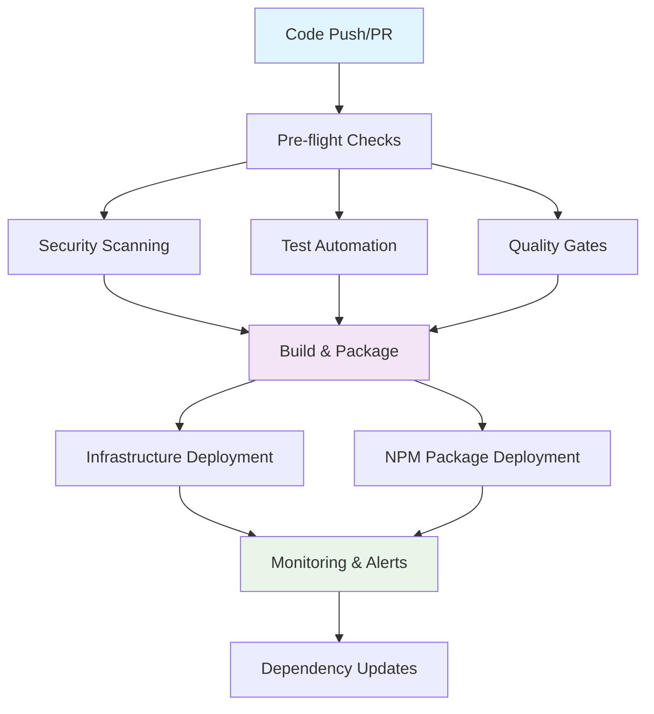

# 🚀 CI/CD Pipeline Documentation

This directory contains the complete CI/CD pipeline infrastructure for the Claude Flow project, designed for enterprise-grade deployment and monitoring.

## 📋 Overview

Our CI/CD pipeline provides:
- **Automated Testing** - Comprehensive test suites including unit, integration, e2e, and performance tests
- **Security Scanning** - Vulnerability detection, secret scanning, and compliance checks
- **Quality Gates** - Code coverage, performance, and quality thresholds
- **Deployment Automation** - Multi-environment deployment with rollback capabilities
- **Monitoring & Alerts** - Real-time system monitoring and alerting
- **Dependency Management** - Automated security updates and dependency health monitoring

## 🏗️ Pipeline Architecture



## 📁 Workflow Files

### Core CI/CD Workflows

| Workflow | Purpose | Triggers | Duration |
|----------|---------|----------|----------|
| [`ci-cd.yml`](./workflows/ci-cd.yml) | Main CI/CD pipeline | Push, PR, Release | 15-20 min |
| [`test-automation.yml`](./workflows/test-automation.yml) | Comprehensive testing | Push, PR, Schedule | 20-30 min |
| [`security-scanning.yml`](./workflows/security-scanning.yml) | Security analysis | Push, PR, Weekly | 10-15 min |
| [`quality-gates.yml`](./workflows/quality-gates.yml) | Quality validation | Push, PR, Daily | 15-25 min |

### Deployment Workflows

| Workflow | Purpose | Triggers | Duration |
|----------|---------|----------|----------|
| [`npm-package-deployment.yml`](./workflows/npm-package-deployment.yml) | NPM package publishing | Push, Tag, Manual | 10-15 min |
| [`infrastructure-deployment.yml`](./workflows/infrastructure-deployment.yml) | Infrastructure deployment | Push, Manual | 15-25 min |

### Operations Workflows

| Workflow | Purpose | Triggers | Duration |
|----------|---------|----------|----------|
| [`monitoring-alerts.yml`](./workflows/monitoring-alerts.yml) | System monitoring | Schedule (15min), Manual | 5-10 min |
| [`dependency-updates.yml`](./workflows/dependency-updates.yml) | Dependency management | Weekly, Manual | 20-30 min |

## 🔧 Configuration

### Required Secrets

Add these secrets to your GitHub repository:

#### NPM Publishing
```bash
NPM_TOKEN=your_npm_token
```

#### Docker Registry
```bash
DOCKERHUB_USERNAME=your_dockerhub_username
DOCKERHUB_TOKEN=your_dockerhub_token
```

#### Security Scanning
```bash
SNYK_TOKEN=your_snyk_token
CODECOV_TOKEN=your_codecov_token
```

#### Environment-Specific
```bash
# Staging Environment
STAGING_DATABASE_URL=your_staging_db_url
STAGING_REDIS_URL=your_staging_redis_url
STAGING_LANGFUSE_SECRET_KEY=your_staging_langfuse_secret
STAGING_LANGFUSE_PUBLIC_KEY=your_staging_langfuse_public

# Production Environment
PRODUCTION_DATABASE_URL=your_production_db_url
PRODUCTION_REDIS_URL=your_production_redis_url
PRODUCTION_LANGFUSE_SECRET_KEY=your_production_langfuse_secret
PRODUCTION_LANGFUSE_PUBLIC_KEY=your_production_langfuse_public
```

#### Dependency Updates
```bash
DEPENDENCY_UPDATE_TOKEN=your_github_token_with_repo_permissions
```

### Environment Variables

The pipelines use these environment variables:

| Variable | Default | Description |
|----------|---------|-------------|
| `NODE_VERSION` | `20` | Node.js version for builds |
| `QUALITY_THRESHOLD_COVERAGE` | `80` | Minimum code coverage % |
| `QUALITY_THRESHOLD_PERFORMANCE` | `95` | Minimum performance score % |
| `ALERT_THRESHOLD_ERROR_RATE` | `5` | Maximum error rate % |
| `ALERT_THRESHOLD_RESPONSE_TIME` | `500` | Maximum response time (ms) |

## 🧪 Testing Strategy

### Test Matrix

Our testing strategy includes:

#### Unit Tests
- **Coverage**: 80%+ required
- **Frameworks**: Jest with experimental VM modules
- **Parallel Execution**: 4 shards for faster execution
- **Platforms**: Ubuntu, Windows, macOS
- **Node Versions**: 18, 20, 22

#### Integration Tests
- **Services**: Redis, SQLite in-memory
- **Environment**: Isolated test environment
- **Duration**: 25 minutes timeout
- **Coverage**: API endpoints, database connections

#### End-to-End Tests
- **Browsers**: Chromium, Firefox
- **Framework**: Playwright
- **Environment**: Full application stack
- **Duration**: 30 minutes timeout

#### Performance Tests
- **Tools**: Custom Python benchmarks
- **Metrics**: Response time, throughput, resource usage
- **Baseline**: Continuous performance tracking
- **Alerts**: Regression detection (>110% baseline)

### Package Testing

We test multiple packages in parallel:
- `src/migration` - Migration utilities
- `langfuse-source` - Langfuse integration
- `examples/05-swarm-apps/rest-api` - Example applications

## 🛡️ Security Pipeline

### Multi-Layer Security

1. **Dependency Scanning**
   - NPM audit (moderate+ severity)
   - Snyk vulnerability scanning
   - License compliance checking

2. **Static Analysis**
   - CodeQL for JavaScript/TypeScript
   - ESLint security rules
   - Semgrep for OWASP patterns

3. **Secret Detection**
   - TruffleHog for exposed secrets
   - GitLeaks for git history
   - Custom pattern matching

4. **Container Security**
   - Trivy vulnerability scanning
   - Docker Bench security
   - Multi-stage build optimization

5. **Infrastructure Security**
   - GitHub Actions security review
   - Configuration drift detection
   - Access control validation

### Security Thresholds

| Level | Coverage | Performance | Security |
|-------|----------|-------------|----------|
| Minimal | 60% | 90% | High severity only |
| Standard | 75% | 93% | Medium+ severity |
| Comprehensive | 85% | 95% | Medium+ severity |
| Enterprise | 90% | 97% | Low+ severity |

## 🏆 Quality Gates

### Quality Levels

Quality gates adapt based on branch and manual configuration:

- **Main Branch**: Enterprise level (90% coverage, 97% performance)
- **Develop Branch**: Comprehensive level (85% coverage, 95% performance)
- **Feature Branches**: Standard level (75% coverage, 93% performance)

### Gate Components

1. **Code Coverage** - Unit and integration test coverage
2. **Performance** - Benchmark scores and response times
3. **Security** - Vulnerability counts and severity
4. **Code Quality** - Linting, formatting, type safety
5. **Documentation** - README files, API docs, inline comments
6. **Dependencies** - License compliance, update status

## 🚀 Deployment Strategy

### Multi-Environment Pipeline

#### Staging Deployment
- **Trigger**: Push to `develop` or `enterprise-swarm-platform`
- **Environment**: `staging.claude-flow.com`
- **Strategy**: Direct deployment with health checks
- **Duration**: 15 minutes

#### Production Deployment
- **Trigger**: Push to `main` branch
- **Environment**: `claude-flow.com`
- **Strategy**: Blue-Green deployment
- **Duration**: 25 minutes
- **Approvals**: Required for production environment

### Container Strategy

We build and deploy multiple container images:
- `claude-flow-langfuse` - Main Langfuse service
- `claude-flow-web` - Web interface
- `claude-flow-worker` - Background worker
- `claude-flow-coordinator` - Swarm coordinator
- `claude-flow-agent` - Swarm agent

### Rollback Capabilities

- **Automatic**: On deployment failure
- **Manual**: Via workflow dispatch input
- **Strategy**: Previous stable version restoration
- **Verification**: Post-rollback health checks

## 📊 Monitoring & Alerting

### Monitoring Components

1. **Health Monitoring** (Every 15 minutes)
   - Build system health
   - Service connectivity
   - Dependency status

2. **Performance Monitoring**
   - Response time tracking
   - Resource usage (CPU, Memory)
   - Throughput metrics

3. **Security Monitoring**
   - Vulnerability scanning
   - Secret exposure detection
   - License compliance

4. **Infrastructure Monitoring**
   - Docker configuration validation
   - Service discovery checks
   - Storage usage monitoring

### Alert Thresholds

| Metric | Warning | Critical |
|--------|---------|----------|
| Response Time | 300ms | 500ms |
| CPU Usage | 70% | 80% |
| Memory Usage | 75% | 85% |
| Error Rate | 3% | 5% |
| Storage Usage | 80% | 90% |

### Notification Channels

- **GitHub Issues**: For persistent problems
- **Slack Integration**: Real-time alerts (if configured)
- **Email Notifications**: Critical alerts
- **Dashboard Updates**: Grafana/custom dashboards

## 🔄 Dependency Management

### Automated Updates

- **Schedule**: Weekly on Mondays at 9 AM UTC
- **Types**: Patch, Minor, Major, Security-only
- **Testing**: Full test suite before merge
- **Auto-merge**: Configurable for safe updates

### Update Strategy

1. **Security Updates** (Priority)
   - Immediate application via `npm audit fix`
   - Automatic PR creation
   - Expedited review process

2. **Regular Updates**
   - Patch: Safe, auto-mergeable
   - Minor: Review recommended
   - Major: Manual review required

3. **Health Monitoring**
   - Dependency health score (0-100)
   - Deprecated package detection
   - License compatibility checking

## 📈 Performance Optimization

### Parallel Execution

- **Test Sharding**: 4 parallel test shards
- **Multi-OS Testing**: Parallel across Ubuntu, Windows, macOS
- **Container Builds**: Parallel image building
- **Artifact Caching**: NPM and build cache optimization

### Resource Optimization

- **Timeout Management**: Appropriate timeouts for each job
- **Resource Limits**: Memory and CPU optimization
- **Cache Strategy**: Multi-level caching (NPM, build artifacts)
- **Conditional Execution**: Skip unnecessary jobs based on changes

## 🔍 Troubleshooting

### Common Issues

#### Build Failures
```bash
# Check Node.js version compatibility
node --version
npm --version

# Clear cache and reinstall
npm ci --prefer-offline
```

#### Test Failures
```bash
# Run tests locally with same configuration
NODE_OPTIONS='--experimental-vm-modules' npm test

# Check for platform-specific issues
npm run test:unit -- --detectOpenHandles
```

#### Deployment Issues
```bash
# Validate Docker configurations
docker-compose -f docker-compose.yml config

# Check environment variables
env | grep -E "(DATABASE|REDIS|LANGFUSE)"
```

### Debug Mode

Enable debug mode by setting:
```yaml
env:
  DEBUG: 'true'
  VERBOSE_LOGGING: 'true'
```

### Log Analysis

Logs are available in:
- **GitHub Actions**: Workflow run logs
- **Artifacts**: Uploaded test reports and logs
- **External Services**: Langfuse, monitoring dashboards

## 🚀 Getting Started

### Quick Setup

1. **Fork/Clone** the repository
2. **Configure Secrets** in GitHub repository settings
3. **Enable Actions** in repository settings
4. **Push Changes** to trigger first pipeline run

### Local Development

```bash
# Install dependencies
npm ci

# Run local tests
npm test

# Build project
npm run build

# Run quality checks
npm run lint
npm run typecheck
```

### Pipeline Testing

```bash
# Test individual workflows locally using act
act -j test -W .github/workflows/test-automation.yml

# Validate workflow syntax
actionlint .github/workflows/*.yml
```

## 📚 Additional Resources

- [GitHub Actions Documentation](https://docs.github.com/en/actions)
- [Docker Best Practices](https://docs.docker.com/develop/dev-best-practices/)
- [Node.js Testing Guide](https://nodejs.org/en/docs/guides/testing/)
- [Security Scanning Tools](https://github.com/analysis-tools-dev/static-analysis)

## 🤝 Contributing

### Pipeline Improvements

1. **Fork** the repository
2. **Create** a feature branch for pipeline changes
3. **Test** changes thoroughly
4. **Submit** a pull request with detailed description

### Monitoring Enhancements

- Add new monitoring metrics
- Improve alert thresholds
- Enhance dashboard visualizations
- Optimize performance bottlenecks

### Security Hardening

- Add new security scanning tools
- Improve secret detection patterns
- Enhance compliance checking
- Strengthen access controls

---

**Maintained by**: CI/CD Team  
**Last Updated**: $(date)  
**Version**: 1.0.0  
**Status**: ✅ Operational