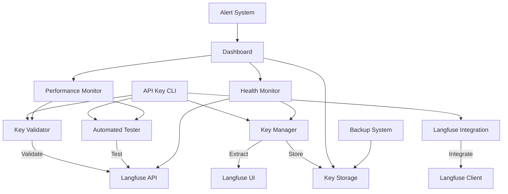

# Langfuse API Key Management System Documentation

## 🎯 Overview

The Langfuse API Key Management System is a comprehensive, production-ready solution for managing Langfuse API keys with advanced validation, automated testing, real-time monitoring, and seamless integration capabilities. This system provides enterprise-grade security, automated key rotation, and comprehensive observability for mission-critical applications.

## 🏗️ Architecture

### System Architecture



### Core Components

#### 1. **LangfuseApiKeyManager** (`LangfuseApiKeyManager.js`)
- **Key Extraction**: Automated extraction from Langfuse UI
- **Storage Management**: Secure encrypted key storage
- **Rotation Handling**: Automated key rotation and validation
- **Environment Sync**: Automatic environment file updates

#### 2. **LangfuseKeyValidator** (`LangfuseKeyValidator.js`)
- **Multi-stage Validation**: Format, connectivity, and functionality validation
- **Performance Testing**: Response time and throughput validation
- **Security Validation**: Authentication and authorization testing
- **Health Monitoring**: Continuous validation and alerting

#### 3. **AutomatedKeyTester** (`AutomatedKeyTester.js`)
- **Stress Testing**: High-load performance validation
- **Endurance Testing**: Long-running stability verification
- **Regression Testing**: Feature compatibility validation
- **Continuous Monitoring**: Real-time health and performance tracking

#### 4. **LangfuseIntegration** (`LangfuseIntegration.js`)
- **Seamless Integration**: Drop-in replacement for Langfuse client
- **Automatic Failover**: Multi-key redundancy and fallback
- **Performance Optimization**: Connection pooling and caching
- **Observability**: Comprehensive tracing and metrics

#### 5. **Performance Benchmark** (`PerformanceBenchmark.js`)
- **Load Testing**: Concurrent request handling validation
- **Latency Analysis**: Response time optimization
- **Throughput Measurement**: Request per second benchmarking
- **Resource Monitoring**: CPU, memory, and network utilization

## 🚀 Installation & Setup

### Prerequisites

```bash
# Required Software
- Node.js 18+ (Recommended: v20.x)
- npm 9+
- Running Langfuse instance
- Access to Langfuse UI for key extraction

# Verify installation
node --version  # >= 18.0.0
npm --version   # >= 9.0.0
curl http://localhost:3000/api/public/health  # Langfuse health check
```

### Quick Installation

```bash
# Clone the repository
git clone https://github.com/your-org/langfuse-api-key-management.git
cd langfuse-api-key-management

# Install dependencies
npm install

# Global installation (optional)
npm install -g .

# Verify installation
node api-key-cli.js --version
```

### Automated Setup

```bash
# Complete automated setup
node api-key-cli.js setup --auto

# Interactive setup with customization
node api-key-cli.js setup --interactive

# Verify setup
node api-key-cli.js status
```

### Manual Configuration

```bash
# Copy configuration template
cp .env.example .env

# Edit configuration
nano .env

# Initialize key management
node api-key-cli.js setup --manual
```

## 🖥️ CLI Interface

### Command Structure

```bash
# General syntax
node api-key-cli.js <command> [options]

# Global options
--verbose, -v    Enable verbose logging
--config, -c     Specify configuration file
--help, -h       Show help information
--version        Show version information
```

### Available Commands

#### Status and Health
```bash
# System status overview
node api-key-cli.js status

# Detailed health check
node api-key-cli.js status --detailed

# Component-specific status
node api-key-cli.js status --component validator
node api-key-cli.js status --component tester
node api-key-cli.js status --component integration
```

#### Key Management
```bash
# List current keys
node api-key-cli.js keys --list

# Refresh keys from UI
node api-key-cli.js keys --refresh

# Manual key setting
node api-key-cli.js keys --set "pk-lf-abc123,sk-lf-def456"

# Generate new keys (if supported)
node api-key-cli.js keys --generate

# Rotate keys
node api-key-cli.js keys --rotate
```

#### Validation
```bash
# Full validation suite
node api-key-cli.js validate

# Quick validation
node api-key-cli.js validate --quick

# Specific key validation
node api-key-cli.js validate --keys "pk-lf-abc123,sk-lf-def456"

# Validation with custom host
node api-key-cli.js validate --host "https://cloud.langfuse.com"
```

#### Testing
```bash
# Basic functionality test
node api-key-cli.js test

# Stress test suite
node api-key-cli.js test --suite stress

# Integration test suite
node api-key-cli.js test --suite integration

# Continuous monitoring
node api-key-cli.js test --monitor

# Custom test duration
node api-key-cli.js test --duration 3600 --interval 30
```

#### Export and Import
```bash
# Export configuration
node api-key-cli.js export --format env --output .env.langfuse
node api-key-cli.js export --format json --output config.json
node api-key-cli.js export --format yaml --output config.yaml

# Import configuration
node api-key-cli.js import --file config.json
node api-key-cli.js import --format env --file .env.langfuse
```

### Advanced Usage Examples

```bash
# Complete system validation
node api-key-cli.js validate --full --report validation-report.json

# Stress test with custom parameters
node api-key-cli.js test --suite stress --concurrent 50 --duration 300

# Monitoring with alerts
node api-key-cli.js test --monitor --alert-webhook "https://hooks.slack.com/..."

# Performance benchmarking
node api-key-cli.js benchmark --operations 1000 --concurrent 10

# Health monitoring daemon
node api-key-cli.js monitor --daemon --interval 60 --log /var/log/langfuse-health.log
```

## 📖 API Integration

### Basic Integration

```javascript
import { LangfuseIntegration } from './LangfuseIntegration.js';

// Initialize integration
const integration = new LangfuseIntegration({
  langfuseHost: 'http://localhost:3000',
  enableMonitoring: true,
  enableTesting: true,
  enableFailover: true
});

// Initialize and get client
await integration.initialize();
const langfuse = integration.getLangfuseClient();

// Use as normal Langfuse client
const trace = langfuse.trace({
  name: "my-operation",
  input: { query: "example" },
  metadata: { version: "1.0" }
});

// Enhanced tracing with management features
const enhancedTrace = await integration.createTrace(
  'Enhanced Operation',
  { input: 'data' },
  { 
    metadata: 'example',
    monitoring: true,
    fallback: true
  }
);
```

### Advanced Integration

```javascript
import {
  LangfuseApiKeyManager,
  LangfuseKeyValidator,
  AutomatedKeyTester,
  PerformanceBenchmark
} from './index.js';

// Manual component initialization
const manager = new LangfuseApiKeyManager({
  langfuseHost: 'http://localhost:3000',
  keyRotationInterval: 24 * 60 * 60 * 1000, // 24 hours
  enableEncryption: true,
  backupEnabled: true
});

// Initialize key management
await manager.initialize();
const keys = await manager.getCurrentKeys();

// Advanced validation
const validator = new LangfuseKeyValidator({
  timeout: 10000,
  retries: 3,
  enablePerformanceValidation: true,
  performanceThreshold: 2000 // 2 seconds
});

const validationResult = await validator.validateKeys(
  keys.publicKey, 
  keys.secretKey,
  {
    includePerformance: true,
    includeSecurity: true,
    includeCompatibility: true
  }
);

// Automated testing setup
const tester = new AutomatedKeyTester({
  publicKey: keys.publicKey,
  secretKey: keys.secretKey,
  langfuseHost: 'http://localhost:3000',
  testInterval: 300000, // 5 minutes
  enableContinuousMonitoring: true
});

// Start continuous testing
await tester.start();

// Performance benchmarking
const benchmark = new PerformanceBenchmark({
  publicKey: keys.publicKey,
  secretKey: keys.secretKey,
  langfuseHost: 'http://localhost:3000'
});

const results = await benchmark.runBenchmark({
  operations: 1000,
  concurrency: 10,
  duration: 300000 // 5 minutes
});
```

### Integration with Existing Code

```javascript
// Replace existing Langfuse initialization
// BEFORE:
/*
import { Langfuse } from 'langfuse';
const langfuse = new Langfuse({
  publicKey: process.env.LANGFUSE_PUBLIC_KEY,
  secretKey: process.env.LANGFUSE_SECRET_KEY,
  baseUrl: process.env.LANGFUSE_HOST
});
*/

// AFTER:
import { createLangfuseIntegration } from './LangfuseIntegration.js';

const integration = createLangfuseIntegration({
  autoKeyManagement: true,
  enableHealthMonitoring: true,
  enableFailover: true
});

await integration.initialize();
const langfuse = integration.getLangfuseClient();

// Use exactly as before - no code changes required
const trace = langfuse.trace({
  name: "my-operation",
  input: { query: "example" }
});
```

## ⚙️ Configuration

### Environment Variables

```bash
# Core Configuration
LANGFUSE_HOST=http://localhost:3000
LANGFUSE_PUBLIC_KEY=pk-lf-...  # Optional - auto-managed
LANGFUSE_SECRET_KEY=sk-lf-...  # Optional - auto-managed

# Key Management
LANGFUSE_KEY_MANAGEMENT_ENABLED=true
LANGFUSE_AUTO_VALIDATION=true
LANGFUSE_AUTO_ROTATION=true
LANGFUSE_KEY_ROTATION_INTERVAL=86400000  # 24 hours in ms

# Performance and Monitoring
LANGFUSE_MONITORING_ENABLED=true
LANGFUSE_PERFORMANCE_THRESHOLD=2000  # 2 seconds
LANGFUSE_HEALTH_CHECK_INTERVAL=60000  # 1 minute
LANGFUSE_METRICS_ENABLED=true

# Testing Configuration
LANGFUSE_TESTING_ENABLED=true
LANGFUSE_TEST_INTERVAL=300000  # 5 minutes
LANGFUSE_STRESS_TEST_ENABLED=false
LANGFUSE_ENDURANCE_TEST_ENABLED=false

# Security
LANGFUSE_ENCRYPTION_ENABLED=true
LANGFUSE_SECURE_STORAGE=true
LANGFUSE_AUDIT_LOGGING=true
LANGFUSE_ACCESS_CONTROL=true

# Backup and Recovery
LANGFUSE_BACKUP_ENABLED=true
LANGFUSE_BACKUP_INTERVAL=3600000  # 1 hour
LANGFUSE_BACKUP_RETENTION=168  # 7 days
LANGFUSE_RECOVERY_ENABLED=true

# Integration
LANGFUSE_FAILOVER_ENABLED=true
LANGFUSE_FALLBACK_KEYS_COUNT=3
LANGFUSE_CONNECTION_POOLING=true
LANGFUSE_CACHE_ENABLED=true
```

### Advanced Configuration

```javascript
// config/advanced.config.js
const advancedConfig = {
  keyManagement: {
    extractionMethod: 'ui-automation', // 'ui-automation', 'api', 'manual'
    rotationStrategy: 'time-based', // 'time-based', 'usage-based', 'security-based'
    rotationInterval: 24 * 60 * 60 * 1000, // 24 hours
    keyValidationTimeout: 10000,
    maxRetries: 3,
    backoffStrategy: 'exponential',
    enableKeyHistory: true,
    keyHistoryRetention: 7 * 24 * 60 * 60 * 1000 // 7 days
  },
  
  validation: {
    enableFormatValidation: true,
    enableConnectivityValidation: true,
    enableFunctionalityValidation: true,
    enablePerformanceValidation: true,
    enableSecurityValidation: true,
    performanceThreshold: 2000, // milliseconds
    securityScanEnabled: true,
    compatibilityCheckEnabled: true
  },
  
  testing: {
    suites: {
      basic: {
        enabled: true,
        interval: 300000, // 5 minutes
        timeout: 30000
      },
      stress: {
        enabled: false,
        concurrency: 50,
        duration: 300000,
        rampUpTime: 30000
      },
      endurance: {
        enabled: false,
        duration: 24 * 60 * 60 * 1000, // 24 hours
        checkInterval: 300000
      },
      regression: {
        enabled: true,
        triggers: ['key-rotation', 'deployment'],
        baselineComparison: true
      }
    }
  },
  
  monitoring: {
    healthChecks: {
      enabled: true,
      interval: 60000, // 1 minute
      timeout: 10000,
      alertThreshold: 3 // consecutive failures
    },
    metrics: {
      enabled: true,
      collectionInterval: 30000, // 30 seconds
      retention: 7 * 24 * 60 * 60 * 1000, // 7 days
      exportEnabled: true,
      exportFormat: 'prometheus'
    },
    alerting: {
      enabled: true,
      channels: ['webhook', 'email'],
      severityLevels: ['critical', 'warning', 'info'],
      escalationRules: {
        critical: { immediate: true, channels: ['webhook', 'pagerduty'] },
        warning: { delay: 300000, channels: ['webhook'] },
        info: { delay: 900000, channels: ['email'] }
      }
    }
  },
  
  security: {
    encryption: {
      enabled: true,
      algorithm: 'aes-256-gcm',
      keyDerivation: 'pbkdf2',
      saltLength: 32,
      iterations: 100000
    },
    storage: {
      permissions: '0600',
      location: '.langfuse-keys/',
      backupLocation: '.langfuse-keys/backup/',
      secureDelete: true
    },
    accessControl: {
      enabled: true,
      roles: ['admin', 'operator', 'viewer'],
      permissions: {
        admin: ['read', 'write', 'delete', 'rotate'],
        operator: ['read', 'write', 'rotate'],
        viewer: ['read']
      }
    },
    auditing: {
      enabled: true,
      logLevel: 'info',
      includeKeyAccess: true,
      includeValidation: true,
      includeRotation: true,
      retention: 30 * 24 * 60 * 60 * 1000 // 30 days
    }
  },
  
  performance: {
    optimization: {
      connectionPooling: {
        enabled: true,
        maxConnections: 10,
        idleTimeout: 30000,
        connectionTimeout: 5000
      },
      caching: {
        enabled: true,
        ttl: 300000, // 5 minutes
        maxSize: 1000,
        strategy: 'lru'
      },
      rateLimiting: {
        enabled: true,
        maxRequests: 100,
        timeWindow: 60000, // 1 minute
        backoffStrategy: 'exponential'
      }
    },
    benchmarking: {
      enabled: true,
      defaultOperations: 1000,
      defaultConcurrency: 10,
      defaultDuration: 300000, // 5 minutes
      metricsCollection: ['latency', 'throughput', 'errors', 'resources']
    }
  },
  
  integration: {
    failover: {
      enabled: true,
      maxFailoverAttempts: 3,
      failoverTimeout: 5000,
      fallbackKeys: [
        { publicKey: 'pk-lf-backup1', secretKey: 'sk-lf-backup1' },
        { publicKey: 'pk-lf-backup2', secretKey: 'sk-lf-backup2' }
      ]
    },
    compatibility: {
      langfuseVersions: ['>=3.0.0'],
      nodeVersions: ['>=18.0.0'],
      enableVersionChecking: true,
      warnOnIncompatibility: true
    }
  }
};

module.exports = advancedConfig;
```

## 🧪 Testing Framework

### Test Suites

#### 1. Basic Test Suite
```javascript
// Basic functionality validation
const basicTests = {
  keyFormatValidation: {
    description: 'Validate API key format compliance',
    tests: [
      'publicKeyFormat',
      'secretKeyFormat',
      'keyPairConsistency'
    ]
  },
  connectivityTest: {
    description: 'Validate Langfuse service connectivity',
    tests: [
      'healthEndpoint',
      'authenticationEndpoint',
      'apiEndpoint'
    ]
  },
  functionalityTest: {
    description: 'Validate core API functionality',
    tests: [
      'traceCreation',
      'spanCreation',
      'generationLogging',
      'scoreSubmission'
    ]
  }
};
```

#### 2. Stress Test Suite
```javascript
// High-load performance validation
const stressTests = {
  concurrentRequests: {
    description: 'Handle multiple concurrent requests',
    parameters: {
      concurrency: 50,
      operations: 1000,
      duration: 300000 // 5 minutes
    }
  },
  loadBurst: {
    description: 'Handle sudden load spikes',
    parameters: {
      burstSize: 100,
      burstInterval: 10000,
      totalBursts: 10
    }
  },
  sustainedLoad: {
    description: 'Maintain performance under sustained load',
    parameters: {
      rps: 10, // requests per second
      duration: 1800000 // 30 minutes
    }
  }
};
```

#### 3. Integration Test Suite
```javascript
// Cross-system integration validation
const integrationTests = {
  swarmIntegration: {
    description: 'Validate swarm coordination integration',
    tests: [
      'agentCommunication',
      'coordinationPatterns',
      'memorySharing',
      'taskOrchestration'
    ]
  },
  mcpIntegration: {
    description: 'Validate MCP tool integration',
    tests: [
      'toolDiscovery',
      'functionCalling',
      'responseHandling',
      'errorManagement'
    ]
  },
  realTimeIntegration: {
    description: 'Validate real-time features',
    tests: [
      'websocketConnection',
      'streamingData',
      'liveUpdates',
      'eventHandling'
    ]
  }
};
```

### Running Tests

```bash
# Run all test suites
npm run test:all

# Run specific test suite
npm run test:basic
npm run test:stress
npm run test:integration
npm run test:regression

# Custom test execution
node api-key-cli.js test --suite custom --config custom-test.json

# Continuous testing
node api-key-cli.js test --monitor --interval 300 --duration 86400

# Performance benchmarking
node api-key-cli.js benchmark --profile performance-profile.json
```

### Test Configuration

```javascript
// test.config.js
const testConfig = {
  environments: {
    development: {
      langfuseHost: 'http://localhost:3000',
      testDataSize: 'small',
      parallelTests: 2
    },
    staging: {
      langfuseHost: 'https://staging.langfuse.com',
      testDataSize: 'medium',
      parallelTests: 5
    },
    production: {
      langfuseHost: 'https://cloud.langfuse.com',
      testDataSize: 'large',
      parallelTests: 10
    }
  },
  reporting: {
    format: ['json', 'html', 'junit'],
    outputDir: './test-reports',
    includePerformanceMetrics: true,
    includeCoverage: true
  },
  assertions: {
    responseTimeThreshold: 2000,
    errorRateThreshold: 0.01, // 1%
    availabilityThreshold: 0.999 // 99.9%
  }
};
```

## 📊 Monitoring & Analytics

### Real-time Monitoring

#### Health Dashboard
```javascript
// Health monitoring configuration
const healthMonitoring = {
  endpoints: {
    system: '/health/system',
    keys: '/health/keys',
    validation: '/health/validation',
    testing: '/health/testing'
  },
  metrics: {
    keyRotationStatus: 'gauge',
    validationSuccess: 'counter',
    testExecutionTime: 'histogram',
    apiResponseTime: 'gauge',
    errorRate: 'gauge'
  },
  alerts: {
    keyExpiration: { threshold: 86400000, severity: 'warning' }, // 24 hours
    validationFailure: { threshold: 3, severity: 'critical' },
    highErrorRate: { threshold: 0.05, severity: 'warning' }, // 5%
    slowResponse: { threshold: 5000, severity: 'warning' } // 5 seconds
  }
};
```

#### Performance Analytics
```javascript
// Performance tracking
const performanceAnalytics = {
  metrics: {
    apiLatency: {
      type: 'histogram',
      buckets: [10, 50, 100, 500, 1000, 5000, 10000],
      labels: ['operation', 'status']
    },
    throughput: {
      type: 'gauge',
      description: 'Operations per second',
      labels: ['operation_type']
    },
    errorRate: {
      type: 'gauge',
      description: 'Error rate percentage',
      labels: ['error_type', 'severity']
    },
    resourceUsage: {
      type: 'gauge',
      description: 'System resource utilization',
      labels: ['resource_type']
    }
  },
  dashboards: {
    overview: {
      panels: ['system-health', 'key-status', 'performance-summary'],
      refreshInterval: 30000
    },
    detailed: {
      panels: ['latency-histogram', 'throughput-graph', 'error-breakdown'],
      refreshInterval: 10000
    },
    alerting: {
      panels: ['active-alerts', 'alert-history', 'escalation-status'],
      refreshInterval: 5000
    }
  }
};
```

### Custom Metrics

```javascript
// Define custom business metrics
const customMetrics = {
  businessImpact: {
    userSessions: {
      type: 'gauge',
      description: 'Active user sessions using Langfuse',
      labels: ['application', 'region']
    },
    traceVolume: {
      type: 'counter',
      description: 'Total traces processed',
      labels: ['source', 'trace_type']
    },
    costOptimization: {
      type: 'gauge',
      description: 'Cost savings from key optimization',
      labels: ['optimization_type']
    }
  },
  operationalEfficiency: {
    automationRate: {
      type: 'gauge',
      description: 'Percentage of automated operations',
      labels: ['operation_category']
    },
    mttr: {
      type: 'histogram',
      description: 'Mean time to recovery',
      buckets: [60, 300, 900, 1800, 3600],
      labels: ['incident_type']
    },
    slaCompliance: {
      type: 'gauge',
      description: 'SLA compliance percentage',
      labels: ['sla_type', 'time_period']
    }
  }
};
```

## 🚨 Alert Management

### Alert Configuration

```javascript
// Comprehensive alert system
const alertSystem = {
  channels: {
    slack: {
      enabled: true,
      webhook: process.env.SLACK_WEBHOOK_URL,
      channel: '#langfuse-alerts',
      format: 'slack',
      severityFilter: ['critical', 'warning']
    },
    email: {
      enabled: true,
      smtp: {
        host: 'smtp.company.com',
        port: 587,
        secure: false,
        auth: {
          user: process.env.SMTP_USER,
          pass: process.env.SMTP_PASS
        }
      },
      recipients: ['ops@company.com', 'dev@company.com'],
      severityFilter: ['critical']
    },
    pagerduty: {
      enabled: true,
      integrationKey: process.env.PAGERDUTY_INTEGRATION_KEY,
      escalationPolicy: 'langfuse-escalation',
      severityFilter: ['critical']
    },
    webhook: {
      enabled: true,
      endpoints: [
        {
          url: 'https://monitoring.company.com/alerts',
          method: 'POST',
          headers: { 'Authorization': 'Bearer ' + process.env.MONITORING_TOKEN },
          format: 'json'
        }
      ]
    }
  },
  
  rules: {
    keyExpiration: {
      condition: 'key_expiry_time < now() + interval "24 hours"',
      severity: 'warning',
      message: 'Langfuse API key expires within 24 hours',
      channels: ['slack', 'email'],
      escalation: {
        delay: 3600000, // 1 hour
        severityIncrease: 'critical'
      }
    },
    validationFailure: {
      condition: 'validation_failures_count >= 3',
      severity: 'critical',
      message: 'Multiple consecutive validation failures detected',
      channels: ['slack', 'pagerduty'],
      autoRemediation: ['key-refresh', 'fallback-activation']
    },
    performanceDegradation: {
      condition: 'avg_response_time > 5000 for 5 minutes',
      severity: 'warning',
      message: 'Langfuse API response time degraded',
      channels: ['slack'],
      autoRemediation: ['connection-reset', 'load-balancing']
    },
    highErrorRate: {
      condition: 'error_rate > 0.05 for 2 minutes',
      severity: 'critical',
      message: 'High error rate detected in Langfuse operations',
      channels: ['slack', 'pagerduty'],
      autoRemediation: ['failover-activation', 'circuit-breaker']
    }
  },
  
  escalation: {
    policies: {
      standard: {
        levels: [
          { delay: 0, channels: ['slack'] },
          { delay: 900000, channels: ['email'] }, // 15 minutes
          { delay: 1800000, channels: ['pagerduty'] } // 30 minutes
        ]
      },
      critical: {
        levels: [
          { delay: 0, channels: ['slack', 'pagerduty'] },
          { delay: 300000, channels: ['email'] } // 5 minutes
        ]
      }
    }
  }
};
```

### Alert Response Actions

```javascript
// Automated alert responses
const alertResponses = {
  keyExpiration: [
    'attemptKeyRotation',
    'activateFallbackKeys',
    'notifyOperationsTeam'
  ],
  validationFailure: [
    'retryValidation',
    'refreshKeysFromUI',
    'checkLangfuseHealth',
    'activateBackupKeys'
  ],
  performanceDegradation: [
    'resetConnections',
    'activateConnectionPooling',
    'enableCaching',
    'routeToHealthyEndpoint'
  ],
  highErrorRate: [
    'activateCircuitBreaker',
    'switchToFallbackKeys',
    'enableRetryMechanism',
    'escalateToOperations'
  ]
};
```

## 🔒 Security & Compliance

### Security Features

#### Encryption and Storage
```javascript
// Advanced security configuration
const securityConfig = {
  keyStorage: {
    encryption: {
      algorithm: 'aes-256-gcm',
      keyDerivation: {
        algorithm: 'pbkdf2',
        iterations: 100000,
        saltLength: 32,
        hashFunction: 'sha512'
      },
      ivLength: 16,
      tagLength: 16
    },
    storage: {
      location: '.langfuse-keys/',
      permissions: '0600',
      backupLocation: '.langfuse-keys/backup/',
      secureDelete: true,
      compressionEnabled: false
    }
  },
  
  accessControl: {
    authentication: {
      required: true,
      methods: ['api-key', 'oauth2', 'certificate'],
      sessionTimeout: 3600000, // 1 hour
      maxConcurrentSessions: 3
    },
    authorization: {
      rbac: {
        enabled: true,
        roles: {
          admin: {
            permissions: ['read', 'write', 'delete', 'rotate', 'configure'],
            keyAccess: 'full',
            systemAccess: 'full'
          },
          operator: {
            permissions: ['read', 'write', 'rotate'],
            keyAccess: 'managed',
            systemAccess: 'limited'
          },
          viewer: {
            permissions: ['read'],
            keyAccess: 'view-only',
            systemAccess: 'read-only'
          }
        }
      }
    }
  },
  
  auditing: {
    enabled: true,
    events: [
      'key-access',
      'key-rotation',
      'validation-attempts',
      'configuration-changes',
      'security-violations'
    ],
    storage: {
      location: '.langfuse-keys/audit/',
      retention: 2592000000, // 30 days
      encryption: true,
      integrity: 'sha256-hmac'
    },
    reporting: {
      dailySummary: true,
      anomalyDetection: true,
      complianceReporting: true
    }
  },
  
  compliance: {
    standards: ['SOX', 'GDPR', 'HIPAA', 'SOC2'],
    dataClassification: {
      apiKeys: 'confidential',
      validationResults: 'internal',
      performanceMetrics: 'internal',
      auditLogs: 'restricted'
    },
    retentionPolicies: {
      apiKeys: 604800000, // 7 days
      auditLogs: 2592000000, // 30 days
      performanceData: 604800000, // 7 days
      validationHistory: 1209600000 // 14 days
    }
  }
};
```

### Compliance Reports

```javascript
// Generate compliance reports
const complianceReporting = {
  soxCompliance: {
    frequency: 'quarterly',
    requirements: [
      'auditTrailCompleteness',
      'accessControlValidation',
      'changeManagementProcess',
      'segregationOfDuties'
    ],
    outputFormat: 'pdf',
    certification: true
  },
  
  gdprCompliance: {
    frequency: 'monthly',
    requirements: [
      'dataMinimization',
      'purposeLimitation',
      'storageMinimization',
      'dataSubjectRights'
    ],
    outputFormat: 'json',
    automatedAssessment: true
  },
  
  securityAssessment: {
    frequency: 'weekly',
    assessments: [
      'vulnerabilityScanning',
      'penetrationTesting',
      'accessReview',
      'configurationValidation'
    ],
    riskRating: true,
    remediationTracking: true
  }
};
```

## 🔧 Advanced Features

### Automatic Key Rotation

```javascript
// Intelligent key rotation system
const keyRotationSystem = {
  strategies: {
    timeBased: {
      enabled: true,
      interval: 86400000, // 24 hours
      gracePeriod: 3600000, // 1 hour overlap
      autoValidation: true
    },
    usageBased: {
      enabled: false,
      threshold: 1000000, // 1M operations
      preemptiveRotation: 0.9 // 90% of threshold
    },
    securityBased: {
      enabled: true,
      triggers: [
        'compromiseDetection',
        'anomalousActivity',
        'complianceRequirement'
      ],
      immediateRotation: true
    }
  },
  
  process: {
    preRotationValidation: true,
    gracefulTransition: true,
    rollbackCapability: true,
    notificationRequired: true,
    auditingRequired: true
  },
  
  fallbackKeys: {
    count: 3,
    rotationStrategy: 'round-robin',
    validationRequired: true,
    encryptionRequired: true
  }
};
```

### Performance Optimization

```javascript
// Advanced performance optimization
const performanceOptimization = {
  connectionPooling: {
    enabled: true,
    poolSize: {
      min: 2,
      max: 10,
      step: 2
    },
    connectionManagement: {
      idleTimeout: 30000,
      connectionTimeout: 5000,
      keepAlive: true,
      reuseConnections: true
    }
  },
  
  caching: {
    enabled: true,
    strategies: {
      validation: {
        ttl: 300000, // 5 minutes
        maxSize: 1000,
        strategy: 'lru'
      },
      performance: {
        ttl: 60000, // 1 minute
        maxSize: 500,
        strategy: 'lfu'
      }
    }
  },
  
  rateLimiting: {
    enabled: true,
    limits: {
      validation: { max: 100, window: 60000 },
      testing: { max: 50, window: 60000 },
      rotation: { max: 10, window: 3600000 }
    },
    backoffStrategy: 'exponential'
  },
  
  loadBalancing: {
    enabled: true,
    algorithm: 'round-robin',
    healthChecking: true,
    failoverTimeout: 5000
  }
};
```

## 🚀 Deployment & Operations

### Production Deployment

```bash
# Production setup
npm run build:production
npm run deploy:production

# Environment configuration
cp .env.production.example .env.production
nano .env.production

# Security hardening
chmod 600 .env.production
chown langfuse:langfuse .env.production

# Service installation
sudo cp langfuse-api-key-management.service /etc/systemd/system/
sudo systemctl enable langfuse-api-key-management
sudo systemctl start langfuse-api-key-management

# Monitoring setup
sudo cp monitoring/langfuse-monitoring.conf /etc/prometheus/
sudo systemctl reload prometheus
```

### Docker Deployment

```dockerfile
# Dockerfile.production
FROM node:20-alpine

# Security: Create non-root user
RUN addgroup -g 1001 -S langfuse && \
    adduser -S langfuse -u 1001

# Install dependencies
WORKDIR /app
COPY package*.json ./
RUN npm ci --only=production && npm cache clean --force

# Copy application
COPY --chown=langfuse:langfuse . .

# Security: Remove sensitive files
RUN rm -rf .git .env.example tests/ docs/

# Set permissions
RUN chmod 755 /app && \
    chmod 644 /app/*.js && \
    chmod 600 /app/.env.production

USER langfuse

EXPOSE 8080
HEALTHCHECK --interval=30s --timeout=3s --start-period=5s --retries=3 \
  CMD node health-check.js

CMD ["node", "api-key-cli.js", "daemon"]
```

```yaml
# docker-compose.production.yml
version: '3.8'

services:
  langfuse-api-key-manager:
    build:
      context: .
      dockerfile: Dockerfile.production
    environment:
      - NODE_ENV=production
      - LANGFUSE_HOST=${LANGFUSE_HOST}
      - ENCRYPTION_KEY=${ENCRYPTION_KEY}
    volumes:
      - langfuse-keys:/app/.langfuse-keys
      - langfuse-logs:/app/logs
    networks:
      - langfuse-network
    restart: unless-stopped
    deploy:
      resources:
        limits:
          memory: 512M
          cpus: '0.5'
        reservations:
          memory: 256M
          cpus: '0.25'

  prometheus:
    image: prom/prometheus:latest
    volumes:
      - ./monitoring/prometheus.yml:/etc/prometheus/prometheus.yml
    ports:
      - "9090:9090"
    networks:
      - langfuse-network

  grafana:
    image: grafana/grafana:latest
    environment:
      - GF_SECURITY_ADMIN_PASSWORD=${GRAFANA_PASSWORD}
    volumes:
      - grafana-data:/var/lib/grafana
      - ./monitoring/grafana:/etc/grafana/provisioning
    ports:
      - "3001:3000"
    networks:
      - langfuse-network

volumes:
  langfuse-keys:
    driver: local
    driver_opts:
      type: none
      o: bind
      device: /opt/langfuse-keys
  langfuse-logs:
    driver: local
  grafana-data:
    driver: local

networks:
  langfuse-network:
    driver: bridge
```

### Kubernetes Deployment

```yaml
# k8s/deployment.yaml
apiVersion: apps/v1
kind: Deployment
metadata:
  name: langfuse-api-key-manager
  labels:
    app: langfuse-api-key-manager
spec:
  replicas: 2
  selector:
    matchLabels:
      app: langfuse-api-key-manager
  template:
    metadata:
      labels:
        app: langfuse-api-key-manager
    spec:
      securityContext:
        runAsNonRoot: true
        runAsUser: 1001
        fsGroup: 1001
      containers:
      - name: api-key-manager
        image: langfuse/api-key-manager:latest
        ports:
        - containerPort: 8080
        env:
        - name: NODE_ENV
          value: "production"
        - name: LANGFUSE_HOST
          valueFrom:
            configMapKeyRef:
              name: langfuse-config
              key: host
        - name: ENCRYPTION_KEY
          valueFrom:
            secretKeyRef:
              name: langfuse-secrets
              key: encryption-key
        resources:
          requests:
            memory: "256Mi"
            cpu: "250m"
          limits:
            memory: "512Mi"
            cpu: "500m"
        volumeMounts:
        - name: langfuse-keys
          mountPath: /app/.langfuse-keys
        - name: logs
          mountPath: /app/logs
        livenessProbe:
          httpGet:
            path: /health
            port: 8080
          initialDelaySeconds: 30
          periodSeconds: 10
        readinessProbe:
          httpGet:
            path: /ready
            port: 8080
          initialDelaySeconds: 5
          periodSeconds: 5
      volumes:
      - name: langfuse-keys
        persistentVolumeClaim:
          claimName: langfuse-keys-pvc
      - name: logs
        emptyDir: {}

---
apiVersion: v1
kind: Service
metadata:
  name: langfuse-api-key-manager-service
spec:
  selector:
    app: langfuse-api-key-manager
  ports:
  - protocol: TCP
    port: 80
    targetPort: 8080
  type: ClusterIP

---
apiVersion: v1
kind: PersistentVolumeClaim
metadata:
  name: langfuse-keys-pvc
spec:
  accessModes:
  - ReadWriteOnce
  resources:
    requests:
      storage: 1Gi
  storageClassName: fast-ssd
```

## 📊 Metrics & KPIs

### Key Performance Indicators

#### Operational KPIs
```javascript
const operationalKPIs = {
  availability: {
    target: 99.9,
    measurement: 'uptime_percentage',
    period: 'monthly'
  },
  reliability: {
    target: 99.95,
    measurement: 'successful_operations_percentage',
    period: 'daily'
  },
  performance: {
    target: 95,
    measurement: 'operations_under_2s_percentage',
    period: 'hourly'
  },
  recovery: {
    target: 120,
    measurement: 'mean_time_to_recovery_seconds',
    period: 'incident'
  }
};
```

#### Business KPIs
```javascript
const businessKPIs = {
  costOptimization: {
    target: 15,
    measurement: 'cost_reduction_percentage',
    period: 'quarterly'
  },
  automation: {
    target: 90,
    measurement: 'automated_operations_percentage',
    period: 'monthly'
  },
  compliance: {
    target: 100,
    measurement: 'compliance_score_percentage',
    period: 'quarterly'
  },
  efficiency: {
    target: 25,
    measurement: 'operational_efficiency_improvement_percentage',
    period: 'quarterly'
  }
};
```

### Reporting Dashboard

```javascript
// Executive dashboard configuration
const executiveDashboard = {
  sections: {
    overview: {
      widgets: [
        'system-health',
        'key-status',
        'performance-summary',
        'alert-summary'
      ],
      updateInterval: 30000
    },
    operations: {
      widgets: [
        'validation-metrics',
        'testing-results',
        'rotation-history',
        'error-analysis'
      ],
      updateInterval: 60000
    },
    business: {
      widgets: [
        'cost-savings',
        'automation-rate',
        'compliance-score',
        'efficiency-trends'
      ],
      updateInterval: 300000
    }
  },
  
  reports: {
    daily: {
      format: 'email',
      recipients: ['ops@company.com'],
      content: ['summary', 'alerts', 'performance']
    },
    weekly: {
      format: 'pdf',
      recipients: ['management@company.com'],
      content: ['trends', 'analysis', 'recommendations']
    },
    monthly: {
      format: 'presentation',
      recipients: ['executives@company.com'],
      content: ['business-impact', 'roi', 'roadmap']
    }
  }
};
```

## 📄 License

MIT License - see [LICENSE](LICENSE) file for details.

## 🙏 Acknowledgments

- Langfuse team for the excellent observability platform
- Node.js community for the robust runtime environment
- Open source security libraries and best practices
- DevOps community for operational excellence patterns

---

**Langfuse API Key Management System**: Enterprise-grade API key management with automated validation, intelligent rotation, comprehensive monitoring, and seamless integration capabilities.

For support, documentation, and contributions, visit our [GitHub repository](https://github.com/your-org/langfuse-api-key-management).