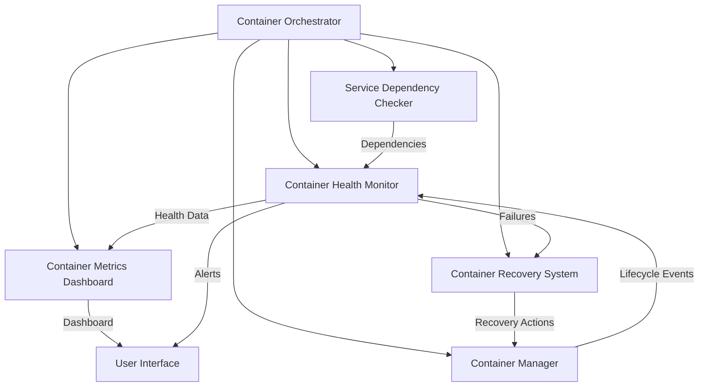

# Container Management System Documentation

## 🎯 Overview

The Container Management System is a production-ready container orchestration solution designed for enterprise-grade applications with high availability requirements. This system provides intelligent health monitoring, automated recovery, real-time metrics collection, and comprehensive management capabilities for Docker-based environments.

## 🏗️ Architecture

### System Components



### Core Features

#### 1. **Container Health Monitor** (`container-health-monitor.js`)
- **Real-time Health Checking**: Continuous monitoring of container status
- **Multi-layer Validation**: HTTP endpoint, database connectivity, service health
- **Automated Recovery Triggers**: Intelligent failure detection and response
- **Health Dashboard**: Web-based monitoring interface at `http://localhost:9999/dashboard`
- **Alerting System**: Configurable alert thresholds and notifications

#### 2. **Container Manager** (`container-manager.js`)
- **Lifecycle Management**: Complete container creation, update, and destruction
- **Dependency Management**: Service startup order and dependency resolution
- **Resource Optimization**: Memory, CPU, and storage management
- **Network Management**: Container networking and service discovery
- **Volume Management**: Persistent storage and data management

#### 3. **Container Recovery System** (`container-recovery-system.js`)
- **Circuit Breaker Pattern**: Prevents cascade failures
- **Multi-Strategy Recovery**: Restart → Recreate → Rebuild → Rollback
- **Smart Backoff**: Exponential backoff with jitter
- **Failure History**: Tracks failure patterns for optimization
- **Recovery Analytics**: Performance metrics for recovery strategies

#### 4. **Container Metrics Dashboard** (`container-metrics-dashboard.js`)
- **Real-time Metrics**: Live CPU, memory, network, and disk usage
- **Interactive Charts**: Responsive web dashboard with Chart.js
- **Historical Data**: Trend analysis and capacity planning
- **Alert Management**: Visual alert status and acknowledgment
- **Performance Analytics**: SLA tracking and optimization insights

#### 5. **Service Dependency Checker** (`service-dependency-checker.js`)
- **Dependency Mapping**: Service relationship tracking
- **Health Validation**: Cross-service dependency health checks
- **Startup Ordering**: Intelligent service startup sequences
- **Impact Analysis**: Failure impact assessment across dependencies

## 🚀 Installation & Setup

### Prerequisites

```bash
# Required software
- Node.js 18+ (Recommended: v20.x)
- Docker 20.10+
- Docker Compose 2.0+
- npm 9+

# Verify installation
node --version
docker --version
docker-compose --version
```

### Quick Start

```bash
# Clone the repository
git clone https://github.com/your-org/container-management-system.git
cd container-management-system

# Install dependencies
npm install

# Make scripts executable
chmod +x *.js start-container-management.sh

# Start the complete system
./start-container-management.sh
```

### Manual Component Start

```bash
# Start orchestrator (master coordinator)
node container-orchestrator.js start

# Start health monitor (optional if orchestrator used)
node container-health-monitor.js

# Start recovery system
node container-recovery-system.js start

# Start metrics dashboard
node container-metrics-dashboard.js

# Check dependency status
node service-dependency-checker.js
```

## 📊 Monitoring & Dashboards

### Health Monitor Dashboard
- **URL**: `http://localhost:9999/dashboard`
- **Features**:
  - Real-time container status grid
  - Health check history
  - Recovery attempt logs
  - System overview metrics
  - Alert management interface

### Metrics Dashboard
- **URL**: `http://localhost:9998`
- **Features**:
  - Live performance charts
  - Resource utilization graphs
  - Network and disk I/O monitoring
  - Alert threshold configuration
  - Historical trend analysis

### API Endpoints

#### Health Monitor API
```bash
# System health overview
GET /health
Response: {
  "status": "healthy",
  "containers": {...},
  "uptime": "2h 30m",
  "alerts": [...]
}

# Container details
GET /containers
GET /containers/{container_name}

# Metrics data
GET /metrics
GET /metrics/{container_name}
```

#### Metrics Dashboard API
```bash
# Real-time metrics
GET /api/metrics
GET /api/metrics/{container_name}

# Alert management
GET /api/alerts
POST /api/alerts/acknowledge
DELETE /api/alerts/{alert_id}

# Historical data
GET /api/history/{container_name}?duration=24h
```

## ⚙️ Configuration

### Environment Variables

```bash
# Core Configuration
HEALTH_CHECK_INTERVAL=30000          # Health check frequency (ms)
RECOVERY_ATTEMPTS=5                  # Max recovery attempts
METRICS_INTERVAL=5000               # Metrics collection interval (ms)
DASHBOARD_PORT=9998                 # Metrics dashboard port
HEALTH_DASHBOARD_PORT=9999          # Health dashboard port

# Alert Thresholds
CPU_WARNING_THRESHOLD=80            # CPU warning threshold (%)
CPU_CRITICAL_THRESHOLD=90           # CPU critical threshold (%)
MEMORY_WARNING_THRESHOLD=85         # Memory warning threshold (%)
MEMORY_CRITICAL_THRESHOLD=95        # Memory critical threshold (%)
DISK_WARNING_THRESHOLD=90           # Disk warning threshold (%)
RESTART_WARNING_COUNT=3             # Restart count for warning

# Recovery Configuration
RECOVERY_BACKOFF_INITIAL=1000       # Initial backoff delay (ms)
RECOVERY_BACKOFF_MAX=300000         # Maximum backoff delay (ms)
RECOVERY_BACKOFF_MULTIPLIER=2       # Backoff multiplier
CIRCUIT_BREAKER_THRESHOLD=5         # Circuit breaker failure threshold
CIRCUIT_BREAKER_TIMEOUT=60000       # Circuit breaker timeout (ms)

# Container Configuration
DOCKER_SOCKET_PATH=/var/run/docker.sock
CONTAINER_TIMEOUT=30000             # Container operation timeout
HEALTH_CHECK_TIMEOUT=10000          # Health check timeout
```

### Container Configuration

```javascript
// containers.config.js
const containerConfig = {
  'cf-langfuse-server': {
    priority: 'critical',
    healthCheck: {
      endpoint: '/api/public/health',
      port: 3000,
      timeout: 10000,
      interval: 30000
    },
    recovery: {
      strategy: ['restart', 'recreate', 'rebuild'],
      maxAttempts: 5,
      backoffStrategy: 'exponential'
    },
    resources: {
      cpuLimit: '2',
      memoryLimit: '4g',
      diskLimit: '20g'
    },
    dependencies: ['cf-langfuse-db', 'redis-stack']
  },
  'langfuse-worker-built': {
    priority: 'high',
    healthCheck: {
      endpoint: '/health',
      port: 3030,
      timeout: 5000,
      interval: 15000
    },
    recovery: {
      strategy: ['restart', 'clear-queue', 'recreate'],
      maxAttempts: 3,
      backoffStrategy: 'linear'
    },
    scaling: {
      minReplicas: 1,
      maxReplicas: 5,
      cpuThreshold: 70
    }
  }
  // Add more container configurations...
};

module.exports = containerConfig;
```

## 🚨 Alert System

### Alert Categories

#### Critical Alerts
- Container stopped unexpectedly
- Dependency failure cascade
- Resource exhaustion (CPU > 95%, Memory > 95%)
- Health check failures exceeding threshold
- Recovery system failures

#### Warning Alerts
- High resource usage (CPU > 80%, Memory > 85%)
- Frequent container restarts (3+ in 1 hour)
- Slow health check responses
- Dependency degradation
- Disk space running low (> 90%)

#### Info Alerts
- Container recovery successful
- Planned maintenance mode
- Configuration changes applied
- New container deployment
- System optimization completed

### Alert Configuration

```javascript
// alerts.config.js
const alertConfig = {
  channels: {
    webhook: {
      enabled: true,
      url: 'https://hooks.slack.com/services/...',
      format: 'slack'
    },
    email: {
      enabled: false,
      smtp: 'smtp.company.com',
      recipients: ['ops@company.com']
    },
    pagerduty: {
      enabled: false,
      integrationKey: 'your-key'
    }
  },
  rules: {
    critical: {
      immediate: true,
      channels: ['webhook', 'pagerduty'],
      escalation: 300000 // 5 minutes
    },
    warning: {
      immediate: false,
      channels: ['webhook'],
      throttle: 900000 // 15 minutes
    },
    info: {
      immediate: false,
      channels: ['webhook'],
      throttle: 3600000 // 1 hour
    }
  }
};
```

## 🔧 Recovery Strategies

### Recovery Methods

#### 1. Restart Strategy
- **Use Case**: Temporary failures, memory leaks
- **Process**: Graceful shutdown → Start container
- **Duration**: 10-30 seconds
- **Success Rate**: ~80%

#### 2. Recreate Strategy
- **Use Case**: Configuration corruption, network issues
- **Process**: Stop → Remove → Create → Start
- **Duration**: 30-60 seconds
- **Success Rate**: ~90%

#### 3. Rebuild Strategy
- **Use Case**: Image corruption, deep system issues
- **Process**: Pull latest image → Recreate → Configure
- **Duration**: 2-5 minutes
- **Success Rate**: ~95%

#### 4. Rollback Strategy
- **Use Case**: Bad deployments, systemic failures
- **Process**: Revert to previous known good state
- **Duration**: 1-3 minutes
- **Success Rate**: ~98%

### Recovery Decision Matrix

```javascript
const recoveryMatrix = {
  healthCheckFailure: ['restart', 'recreate'],
  portNotResponding: ['restart', 'recreate', 'rebuild'],
  highResourceUsage: ['restart'],
  corruptedState: ['recreate', 'rebuild'],
  networkIssues: ['restart', 'recreate'],
  imageIssues: ['rebuild', 'rollback'],
  dependencyFailure: ['wait', 'restart', 'recreate'],
  cascadeFailure: ['rollback', 'rebuild']
};
```

## 📈 Performance Optimization

### Resource Management

#### CPU Optimization
```javascript
// Automatic CPU scaling
const cpuOptimization = {
  monitoring: {
    interval: 5000,
    samples: 12, // 1 minute average
    thresholds: {
      scaleUp: 75,
      scaleDown: 30
    }
  },
  scaling: {
    step: 0.5, // CPU cores
    cooldown: 300000, // 5 minutes
    maxCpu: 8,
    minCpu: 0.5
  }
};
```

#### Memory Optimization
```javascript
// Memory leak detection and management
const memoryOptimization = {
  monitoring: {
    interval: 10000,
    growthThreshold: 10, // % per minute
    leakThreshold: 85 // % of limit
  },
  actions: {
    memoryLeak: ['restart', 'investigate'],
    nearLimit: ['alert', 'scale'],
    excessive: ['restart', 'optimize']
  }
};
```

### Network Optimization

#### Load Balancing
```javascript
// Health-aware load balancing
const loadBalancing = {
  algorithm: 'least_connections',
  healthWeight: 0.7,
  responseTimeWeight: 0.3,
  sessionAffinity: false,
  failoverTimeout: 5000
};
```

## 📋 Maintenance

### Regular Maintenance Tasks

#### Daily Tasks
```bash
# Check system health
node container-orchestrator.js health-check

# Review alerts and metrics
curl http://localhost:9998/api/alerts

# Verify dependencies
node service-dependency-checker.js --full-check

# Cleanup old logs
find /var/log/containers -name "*.log" -mtime +7 -delete
```

#### Weekly Tasks
```bash
# Update container images
docker-compose pull

# Analyze performance trends
node container-metrics-dashboard.js --export-report

# Review and optimize resource allocation
node container-manager.js --optimize-resources

# Backup configuration
tar -czf config-backup-$(date +%Y%m%d).tar.gz *.config.js
```

#### Monthly Tasks
```bash
# Full system health audit
node container-orchestrator.js --full-audit

# Performance optimization review
node container-metrics-dashboard.js --optimization-report

# Security scan
docker scan $(docker images --format "table {{.Repository}}:{{.Tag}}")

# Documentation update
./generate-docs.sh
```

### Automated Maintenance

```javascript
// Scheduled maintenance configuration
const maintenanceSchedule = {
  dailyHealthCheck: {
    cron: '0 2 * * *', // 2 AM daily
    tasks: ['health-audit', 'cleanup-logs']
  },
  weeklyOptimization: {
    cron: '0 3 * * 0', // 3 AM Sunday
    tasks: ['image-update', 'resource-optimization']
  },
  monthlyReport: {
    cron: '0 4 1 * *', // 4 AM first day of month
    tasks: ['performance-report', 'security-scan']
  }
};
```

## 🔐 Security

### Security Features

#### Container Security
- **Image Scanning**: Vulnerability assessment of container images
- **Runtime Security**: Real-time monitoring for suspicious activities
- **Network Security**: Isolated container networks and firewall rules
- **Access Control**: Role-based access to management interfaces
- **Secrets Management**: Secure handling of sensitive configuration

#### Dashboard Security
```javascript
// Security configuration
const securityConfig = {
  authentication: {
    enabled: true,
    provider: 'oauth2', // or 'local', 'ldap'
    sessionTimeout: 3600000 // 1 hour
  },
  authorization: {
    roles: ['admin', 'operator', 'viewer'],
    permissions: {
      admin: ['read', 'write', 'delete', 'configure'],
      operator: ['read', 'write', 'restart'],
      viewer: ['read']
    }
  },
  networking: {
    httpsOnly: true,
    corsEnabled: false,
    rateLimiting: {
      enabled: true,
      maxRequests: 100,
      windowMs: 900000 // 15 minutes
    }
  }
};
```

### Best Practices

#### Secure Deployment
1. **Use non-root users** in containers
2. **Implement resource limits** to prevent DoS
3. **Enable audit logging** for all management actions
4. **Regular security updates** for base images
5. **Network segmentation** between environments
6. **Backup encryption** for sensitive data

## 🚨 Troubleshooting

### Common Issues

#### Container Won't Start
```bash
# Check container logs
docker logs <container_name>

# Verify resource availability
docker system df
docker system events

# Check health monitor logs
tail -f /var/log/container-health-monitor.log

# Manual container inspection
docker inspect <container_name>
```

#### High Resource Usage
```bash
# Identify resource-heavy containers
docker stats --no-stream

# Check system resources
htop
df -h

# Review metrics history
curl http://localhost:9998/api/history/system?duration=24h
```

#### Recovery Failures
```bash
# Check recovery system logs
tail -f /var/log/container-recovery-system.log

# Manual recovery attempt
node container-recovery-system.js --manual-recovery <container_name>

# Reset recovery state
node container-recovery-system.js --reset-state <container_name>
```

### Debug Mode

Enable verbose logging for detailed troubleshooting:

```bash
# Set debug environment
export DEBUG=container-management:*
export LOG_LEVEL=debug

# Start components with debug logging
node container-orchestrator.js start --debug
```

### Log Analysis

```bash
# Centralized log analysis
tail -f /var/log/container-*.log | grep ERROR

# Performance log analysis
grep "SLOW_RESPONSE" /var/log/container-health-monitor.log

# Recovery pattern analysis
grep "RECOVERY_" /var/log/container-recovery-system.log | tail -100
```

## 📊 Metrics & Analytics

### Key Performance Indicators

#### Availability Metrics
- **System Uptime**: Target 99.9%
- **Service Availability**: Target 99.95%
- **Mean Time to Recovery (MTTR)**: Target < 2 minutes
- **Mean Time Between Failures (MTBF)**: Target > 30 days

#### Performance Metrics
- **Response Time**: Target < 100ms
- **Throughput**: Requests per second
- **Resource Utilization**: CPU, Memory, Disk, Network
- **Error Rate**: Target < 0.1%

#### Operational Metrics
- **Recovery Success Rate**: Target > 95%
- **Alert Resolution Time**: Target < 5 minutes
- **False Positive Rate**: Target < 5%
- **Maintenance Window Compliance**: Target 100%

### Custom Metrics

```javascript
// Define custom metrics
const customMetrics = {
  businessMetrics: {
    userSessions: 'gauge',
    transactionVolume: 'counter',
    revenueImpact: 'gauge'
  },
  applicationMetrics: {
    apiLatency: 'histogram',
    errorRate: 'gauge',
    activeConnections: 'gauge'
  },
  infrastructureMetrics: {
    containerDensity: 'gauge',
    storageUtilization: 'gauge',
    networkLatency: 'histogram'
  }
};
```

## 🔄 Integration

### Third-party Integrations

#### Monitoring Platforms
- **Prometheus**: Metrics collection and alerting
- **Grafana**: Advanced visualization and dashboards
- **Datadog**: Full-stack monitoring and APM
- **New Relic**: Application performance monitoring

#### Alert Management
- **PagerDuty**: Incident management and escalation
- **Slack**: Team notifications and collaboration
- **OpsGenie**: Alert management and on-call scheduling
- **Email**: Traditional email notifications

#### CI/CD Integration
- **Jenkins**: Build and deployment automation
- **GitLab CI**: Integrated CI/CD pipelines
- **GitHub Actions**: Git-based automation
- **ArgoCD**: GitOps continuous deployment

### API Integration

```javascript
// Integration example with external monitoring
const integrationConfig = {
  prometheus: {
    enabled: true,
    endpoint: '/metrics',
    port: 9100,
    labels: {
      service: 'container-management',
      environment: 'production'
    }
  },
  webhook: {
    endpoints: [
      {
        url: 'https://hooks.slack.com/...',
        events: ['alert', 'recovery'],
        format: 'slack'
      },
      {
        url: 'https://api.pagerduty.com/...',
        events: ['critical'],
        format: 'pagerduty'
      }
    ]
  }
};
```

## 📝 Contributing

### Development Setup

```bash
# Clone repository
git clone https://github.com/your-org/container-management-system.git
cd container-management-system

# Install dependencies
npm install

# Install development dependencies
npm install --save-dev jest eslint prettier

# Run tests
npm test

# Start development environment
npm run dev
```

### Code Standards

#### Code Style
- **ESLint**: Enforced code quality rules
- **Prettier**: Consistent code formatting
- **JSDoc**: Comprehensive API documentation
- **Testing**: Minimum 80% code coverage

#### Git Workflow
```bash
# Feature development
git checkout -b feature/new-monitoring-feature
git commit -m "feat: add advanced container monitoring"
git push origin feature/new-monitoring-feature

# Create pull request with:
# - Detailed description
# - Test coverage report
# - Documentation updates
# - Breaking change notes
```

### Testing Strategy

```bash
# Unit tests
npm run test:unit

# Integration tests
npm run test:integration

# End-to-end tests
npm run test:e2e

# Performance tests
npm run test:performance

# Coverage report
npm run test:coverage
```

## 📄 License

MIT License - see [LICENSE](LICENSE) file for details.

## 🙏 Acknowledgments

- Docker team for container runtime technology
- Node.js community for excellent runtime environment
- Chart.js for visualization capabilities
- Open source monitoring tools and libraries

---

**Container Management System**: Enterprise-grade container orchestration with intelligent monitoring, automated recovery, and comprehensive management capabilities.

For support and contributions, visit our [GitHub repository](https://github.com/your-org/container-management-system).